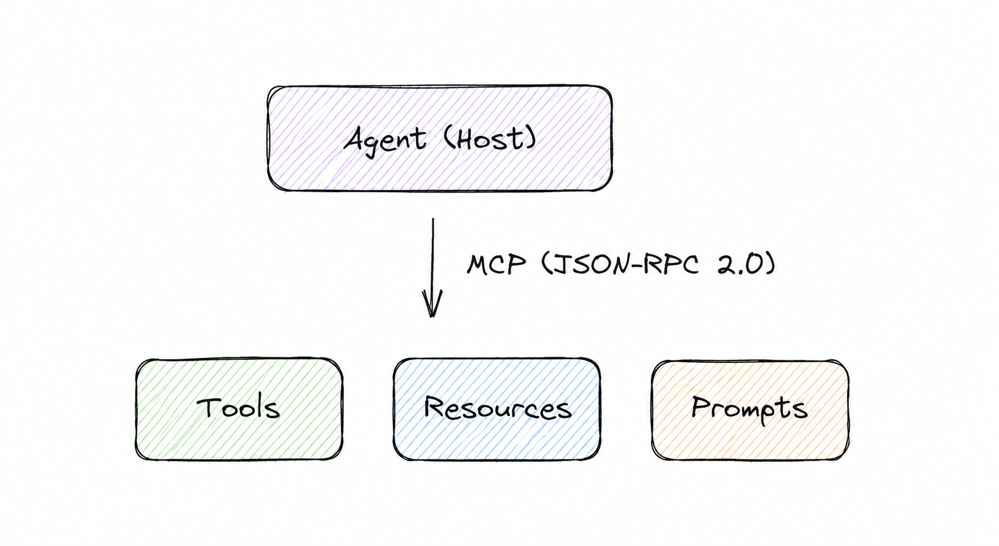
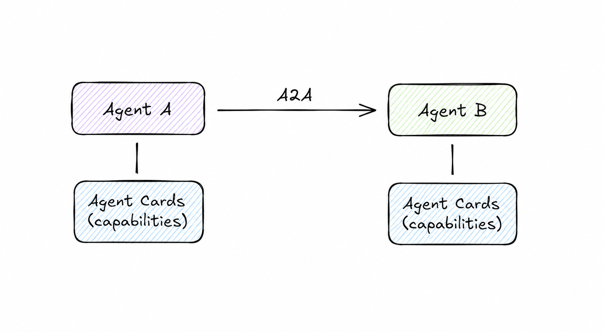
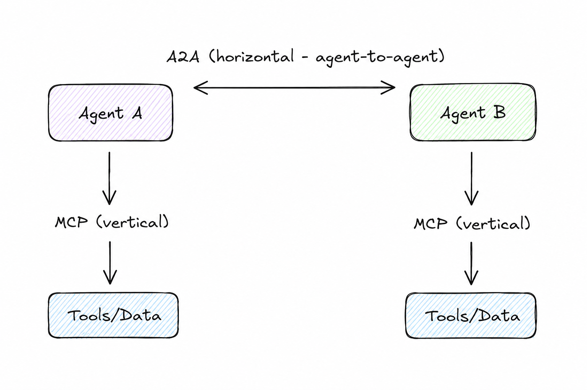

# Agents Integration Patterns

> A catalog of integration patterns for multi-agent AI systems — the missing vocabulary between Enterprise Integration Patterns and the agentic era.

[](https://creativecommons.org/licenses/by/4.0/)
[](CONTRIBUTING.md)

**Read in:** [Português 🇧🇷](README.pt.md)

---

## Why This Exists

In 2003, Gregor Hohpe and Bobby Woolf published *Enterprise Integration Patterns* — a vocabulary of 65 named patterns that gave architects a shared language for connecting distributed systems. That book became the foundation of enterprise middleware, message brokers, and ESBs for over two decades.

In 2025, we are building a new class of distributed systems: **networks of autonomous AI agents** that collaborate to solve complex tasks. These agents communicate through protocols like [Model Context Protocol (MCP)](https://modelcontextprotocol.io) and [Agent-to-Agent (A2A)](https://a2a-protocol.org), orchestrated by frameworks like LangGraph, AutoGen, CrewAI, and Spring AI.

Yet we lack a shared vocabulary. Teams reinvent patterns with different names. Architecture reviews debate the same trade-offs without common terms. Papers exist that taxonomize the space (arXiv:2501.06322, arXiv:2502.14321, arXiv:2508.01186) but stop short of prescriptive, named patterns with intent, problem, and solution structure.

**This repository fills that gap.**

It draws from:
- Enterprise Integration Patterns (Hohpe & Woolf, 2003)
- [12-Factor Agents](https://github.com/humanlayer/12-factor-agents) (HumanLayer, 2025)
- Google's A2A protocol specification
- Anthropic's MCP specification (v2025-11-25)
- Academic surveys on multi-agent LLM systems (2025–2026)

---

## The Protocol Foundation

Before patterns, the two protocols that define the integration surface of modern agent systems:

### Model Context Protocol (MCP) — Vertical Integration
> *"The USB-C port for AI"*

MCP (Anthropic, 2024) is built on JSON-RPC 2.0, inspired by the Language Server Protocol. It standardizes how agents connect **downward** to tools, data sources, and resources.



**What MCP provides:** Tool invocation, resource access, prompt templates, sampling.

### Agent-to-Agent (A2A) — Horizontal Integration
> *"The HTTP for agents"*

A2A (Google, April 2025) enables agents to discover and delegate tasks to **other agents** without exposing internal state, memory, or tools. Discovery happens through **Agent Cards** — capability manifests served at `/.well-known/agent.json`.



**What A2A provides:** Agent discovery, task delegation, capability negotiation, multi-framework interoperability.

### The Complementary Axis

Both protocols co-exist under the Linux Foundation's Agentic AI Foundation (AAIF) as of December 2025. They are not competitors:



> **Security Note:** Combining A2A and MCP introduces compounded risks — confusion, downgrade, and relay-abuse attacks arise because the two protocols operate under different trust assumptions. See [Security Patterns](#-security-patterns). (arXiv:2505.03864, arXiv:2602.11327)

---

## How to Read These Patterns

Each pattern follows this structure:

| Field | Description |
|---|---|
| **Intent** | One-sentence purpose |
| **Problem** | What forces this pattern resolves |
| **Solution** | The structural approach |
| **Diagram** | Visual representation |
| **Consequences** | Trade-offs (forces resolved vs. introduced) |
| **Known Uses** | Where this appears in production systems |
| **Related Patterns** | What to use before/after/instead |

---

## Pattern Catalog

### 🔌 Messaging Patterns

These patterns govern how agents exchange information.

---

#### 1. Direct Message

**Intent:** Send a task from one agent to exactly one other agent through a point-to-point channel.

**Problem:** An agent needs to delegate a specific subtask to another agent with known capabilities, without broadcasting to others.

**Solution:** Establish a dedicated channel between two agents. The sender pushes a structured message (task + context) to the receiver's endpoint. The receiver acknowledges receipt and returns a result.

```
┌──────────┐    Task Request    ┌──────────┐
│ Agent A  │ ─────────────────► │ Agent B  │
│          │ ◄───────────────── │          │
└──────────┘    Task Result     └──────────┘
```

**Consequences:**
- ✅ Simple, predictable, easy to trace
- ✅ Low latency — no intermediary
- ❌ Tight coupling — sender must know receiver's address
- ❌ No load balancing or failover without additional infrastructure

**Known Uses:** A2A task delegation, LangGraph node-to-node edges, tool calls in ReAct agents.

**Related Patterns:** [Agent Card Registry](#4-agent-card-registry) (for discovery), [Supervised Delegation](#11-supervised-delegation) (for reliability).

---

#### 2. Broadcast Message

**Intent:** Send information from one agent to all interested agents simultaneously without knowing who they are.

**Problem:** An agent produces information (an observation, a state change, a completed subtask result) that multiple downstream agents need to act upon.

**Solution:** Publish the message to a shared channel or topic. Interested agents subscribe and react independently. The publisher has no knowledge of subscribers.

```
              ┌──────────┐
              │ Agent A  │ (Publisher)
              └────┬─────┘
                   │ publish("order_placed")
        ┌──────────┼──────────┐
        ▼          ▼          ▼
  ┌──────────┐ ┌──────────┐ ┌──────────┐
  │ Agent B  │ │ Agent C  │ │ Agent D  │
  └──────────┘ └──────────┘ └──────────┘
```

**Consequences:**
- ✅ Decoupled — publisher unaware of subscribers
- ✅ Easily extensible — add agents without modifying publisher
- ❌ No delivery guarantee without infrastructure
- ❌ Risk of message storms if subscribers produce new messages

**Known Uses:** Event-driven CrewAI flows, AutoGen group chat broadcasts, Kafka-backed agent pipelines.

**Related Patterns:** [Scatter-Gather](#9-scatter-gather) (when you need results back), [Choreography](#13-choreography) (event-driven coordination).

---

#### 3. Blackboard

**Intent:** Share a structured, mutable context space that multiple agents read from and write to asynchronously.

**Problem:** Multiple agents work on parts of the same problem. No single agent has the full picture, but they all need to read each other's intermediate results.

**Solution:** Maintain a shared "blackboard" — a structured key-value or document store. Agents read relevant state, contribute their results, and observe changes. An optional controller monitors the blackboard and triggers agents when relevant conditions are met.

```
                ┌─────────────┐
                │  Blackboard │
                │  (shared    │
                │   context)  │
                └──────┬──────┘
       ┌────────────────┼────────────────┐
       ▼                ▼                ▼
 ┌──────────┐    ┌──────────┐    ┌──────────┐
 │ Agent A  │    │ Agent B  │    │ Agent C  │
 │ (reads / │    │ (reads / │    │ (reads / │
 │  writes) │    │  writes) │    │  writes) │
 └──────────┘    └──────────┘    └──────────┘
```

**Consequences:**
- ✅ Natural for parallel, loosely-coupled agents
- ✅ Agents contribute at their own pace
- ❌ Requires conflict resolution when agents write to same key
- ❌ Hard to reason about causality without event ordering

**Known Uses:** AutoGen shared memory, multi-agent research workflows (e.g., multi-agent RAG with shared document store).

**Related Patterns:** [Context Injection](#6-context-injection) (for read-only context), [Orchestrator](#12-orchestrator) (for centralized control).

---

### 🗺️ Discovery Patterns

How agents find each other without hardcoded addresses.

---

#### 4. Agent Card Registry

**Intent:** Allow agents to advertise their capabilities and be discovered by other agents at runtime without prior configuration.

**Problem:** In a dynamic multi-agent system, you cannot hardcode which agent handles which task. New agents join the system, capabilities change, and routing decisions need to happen at runtime.

**Solution:** Each agent publishes an **Agent Card** — a structured capability manifest — at a well-known endpoint (`/.well-known/agent.json`). A registry (or peer-to-peer discovery) indexes these cards. Agents query the registry for capabilities they need, then establish direct connections.

```
Agent Card:
{
  "name": "DataExtractionAgent",
  "description": "Extracts structured data from PDFs",
  "skills": [{ "id": "pdf-extract", "name": "PDF Extraction" }],
  "url": "https://agents.example.com/data-extractor",
  "authentication": { "schemes": ["bearer"] }
}

  ┌──────────┐  "who can extract PDFs?"  ┌──────────────────┐
  │ Agent A  │ ──────────────────────►  │  Agent Registry  │
  │          │ ◄──────────────────────  │  (Agent Cards)   │
  └──────────┘  "Agent B can do that"   └──────────────────┘
       │
       │ connects directly
       ▼
  ┌──────────┐
  │ Agent B  │
  └──────────┘
```

**Consequences:**
- ✅ Dynamic composition — agents join/leave without reconfiguration
- ✅ Capability-based routing
- ❌ Registry becomes a single point of failure
- ❌ Stale cards if agents don't update their capabilities

**Known Uses:** A2A Agent Cards specification, AWS Bedrock Agent Aliases, Azure AI Foundry agent catalog.

**Related Patterns:** [Content-Based Router](#8-content-based-router) (routing after discovery), [Agent Proxy](#5-agent-proxy) (abstraction layer).

---

#### 5. Agent Proxy

**Intent:** Provide a stable interface to an agent (or group of agents) while hiding implementation details, protocol differences, or versioning.

**Problem:** Consumers of an agent's capabilities should not need to know whether the agent is a single LLM call, a sub-graph of agents, an external API, or which protocol it speaks.

**Solution:** Introduce a proxy agent that presents a uniform interface. The proxy translates protocols (e.g., A2A ↔ MCP), routes to appropriate backend agents, and handles versioning.

```
 ┌──────────────┐          ┌─────────────┐
 │  Consumer    │  A2A     │   Agent     │   A2A/MCP/REST
 │  Agent       │ ────────►│   Proxy     │ ─────────────►  Backend(s)
 └──────────────┘          └─────────────┘
```

**Consequences:**
- ✅ Decouples consumers from implementation
- ✅ Enables A/B testing and gradual migration
- ❌ Adds a network hop and latency
- ❌ Proxy becomes a bottleneck if not stateless

**Known Uses:** LangGraph remote agent nodes, API gateway patterns for agent endpoints, MCP proxy servers.

**Related Patterns:** [Agent Card Registry](#4-agent-card-registry), [Circuit Breaker](#16-circuit-breaker).

---

### ⚡ Context Patterns

How agents share, inject, and manage contextual information — inspired by MCP primitives.

---

#### 6. Context Injection

**Intent:** Supply an agent with relevant external context (documents, database records, user state) before it reasons, without the agent needing to fetch it.

**Problem:** An agent's reasoning quality depends on context. Requiring agents to actively fetch every piece of context they need is slow, couples them to data sources, and often exceeds context window limits.

**Solution:** Before invoking an agent, a host or orchestrator retrieves relevant context from data sources (via MCP Resources) and injects it into the agent's prompt or message. The agent reasons over pre-assembled context.

```
 ┌──────────────────────────────────────┐
 │              Host                    │
 │  ┌──────────┐     ┌────────────────┐ │
 │  │  MCP     │────►│ Context        │ │
 │  │ Resources│     │ Assembler      │ │
 │  └──────────┘     └───────┬────────┘ │
 └──────────────────────────┼──────────┘
                             │ inject context
                             ▼
                       ┌──────────┐
                       │  Agent   │
                       └──────────┘
```

**Consequences:**
- ✅ Agents stay stateless and focused on reasoning
- ✅ Context is controlled and auditable
- ❌ Host must know what context is relevant (retrieval quality matters)
- ❌ Large contexts consume tokens; retrieval must be precise

**Known Uses:** RAG pipelines, Anthropic's contextual retrieval, MCP Resources in Claude Desktop.

**Related Patterns:** [Blackboard](#3-blackboard) (shared mutable context), [Tool Provider](#7-tool-provider) (active tool use vs. passive injection).

---

#### 7. Tool Provider

**Intent:** Expose capabilities (functions, APIs, data queries) to agents as invocable tools through a standardized interface.

**Problem:** Agents need to take actions in the world — query databases, call APIs, execute code, search the web. Hardcoding these capabilities into agents makes them brittle and non-reusable.

**Solution:** Wrap capabilities as MCP Tools with structured schemas. Agents discover available tools via the MCP `tools/list` endpoint and invoke them via `tools/call`. The tool provider handles execution and returns structured results.

```
 ┌──────────┐  tools/list   ┌─────────────────────┐
 │  Agent   │ ────────────► │   MCP Tool Server   │
 │          │ ◄──────────── │                     │
 │          │  [tool list]  │  ┌───────────────┐  │
 │          │               │  │ search_web()  │  │
 │          │  tools/call   │  │ query_db()    │  │
 │          │ ────────────► │  │ run_code()    │  │
 │          │ ◄──────────── │  └───────────────┘  │
 └──────────┘  [result]     └─────────────────────┘
```

**Consequences:**
- ✅ Agents are decoupled from specific tool implementations
- ✅ Tools can be versioned, replaced, or mocked independently
- ❌ Tool schemas must be well-designed; poor schemas confuse LLMs
- ❌ Tool explosion — too many tools degrades agent performance

**Known Uses:** MCP Tool Servers, LangChain Tools, OpenAI Function Calling.

**Related Patterns:** [Context Injection](#6-context-injection), [Least-Privilege Tool Scope](#18-least-privilege-tool-scope).

---

### 🔀 Routing Patterns

How tasks are distributed across agents.

---

#### 8. Content-Based Router

**Intent:** Route an incoming task to the appropriate agent based on the content, type, or attributes of the task itself.

**Problem:** A system receives diverse tasks that require different specialized agents. A human (or caller) should not need to know which agent handles which type of task.

**Solution:** A router agent examines the content, metadata, or intent of each incoming task and forwards it to the appropriate specialist agent. The router may use LLM-based intent classification, rule-based matching, or embedding similarity.

```
                     ┌─────────────────────┐
                     │  Router Agent       │
   Incoming Task ──► │  (LLM classifier or │
                     │   rule engine)      │
                     └──────────┬──────────┘
              ┌─────────────────┼─────────────────┐
              ▼                 ▼                 ▼
       ┌──────────┐      ┌──────────┐      ┌──────────┐
       │ Coding   │      │ Research │      │ Data     │
       │ Agent    │      │ Agent    │      │ Agent    │
       └──────────┘      └──────────┘      └──────────┘
```

**Consequences:**
- ✅ Single entry point for callers
- ✅ Specialists can evolve independently
- ❌ Router is a bottleneck and single point of failure
- ❌ Classification errors misroute tasks

**Known Uses:** AWS Bedrock Supervisor mode, LangGraph conditional edges, semantic routing in CrewAI.

**Related Patterns:** [Orchestrator](#12-orchestrator) (when routing is just the first step of coordination), [Agent Card Registry](#4-agent-card-registry) (capability-based routing).

---

#### 9. Scatter-Gather

**Intent:** Send the same task to multiple agents in parallel, then aggregate their responses into a single coherent result.

**Problem:** Complex questions benefit from multiple independent perspectives. Sequential querying is slow. The best answer may require synthesizing diverse outputs.

**Solution:** A dispatcher sends the task to N agents simultaneously. Each agent processes independently. A gatherer/aggregator waits for responses, then synthesizes them — via voting, merging, or a synthesis agent.

```
                ┌──────────┐
                │ Dispatch │
                └────┬─────┘
     ┌───────────────┼───────────────┐
     ▼               ▼               ▼
┌──────────┐   ┌──────────┐   ┌──────────┐
│ Agent A  │   │ Agent B  │   │ Agent C  │
└────┬─────┘   └────┬─────┘   └────┬─────┘
     └───────────────┼───────────────┘
                     ▼
               ┌──────────┐
               │ Aggregate│
               └──────────┘
```

**Consequences:**
- ✅ Parallel execution reduces latency vs. sequential
- ✅ Multiple perspectives improve quality (useful for factual tasks)
- ❌ N× token cost
- ❌ Aggregation is non-trivial; requires a synthesis step

**Known Uses:** Multi-agent debate (Google DeepMind), parallel tool calls, ensemble agent evaluation.

**Related Patterns:** [Orchestrator](#12-orchestrator) (coordinates the scatter-gather), [Broadcast Message](#2-broadcast-message) (when you don't need results back).

---

#### 10. Pipeline

**Intent:** Pass a task through a sequence of agents, where each agent transforms or enriches the result before passing it to the next.

**Problem:** A complex task requires a series of transformations — each step depends on the previous result.

**Solution:** Chain agents as pipeline stages. The output of agent N becomes the input of agent N+1. Each agent has a focused responsibility.

```
 Input ─► Agent A ─► Agent B ─► Agent C ─► Output
         (Plan)    (Execute)  (Verify)
```

**Consequences:**
- ✅ Clear separation of concerns; each agent is testable in isolation
- ✅ Easy to insert, remove, or replace stages
- ❌ Sequential — total latency = sum of all stages
- ❌ Early errors propagate through all downstream stages

**Known Uses:** LangGraph linear graphs, CrewAI sequential process, Anthropic's "prompt chaining" workflow.

**Related Patterns:** [Scatter-Gather](#9-scatter-gather) (parallelize stages when independent), [Checkpoint & Resume](#17-checkpoint--resume) (for long pipelines).

---

### 🎭 Coordination Patterns

How multiple agents decide who does what.

---

#### 11. Supervised Delegation

**Intent:** A supervisor agent decomposes a goal into subtasks, delegates each to a specialist agent, monitors execution, and intervenes on failure.

**Problem:** Complex goals exceed any single agent's capacity. Tasks need to be distributed, but the overall goal must remain coherent and failures must be handled.

**Solution:** The supervisor maintains the high-level plan, assigns tasks to worker agents (via Direct Message or A2A), monitors their progress, and retries, reassigns, or escalates on failure. The supervisor never executes domain tasks itself — it only coordinates.

```
                ┌──────────────┐
                │  Supervisor  │
                │  Agent       │
                └──┬───────────┘
      ┌────────────┼────────────┐
      ▼            ▼            ▼
 ┌─────────┐  ┌─────────┐  ┌─────────┐
 │Worker A │  │Worker B │  │Worker C │
 └─────────┘  └─────────┘  └─────────┘
```

**Consequences:**
- ✅ Clear accountability; supervisor owns the goal
- ✅ Fault tolerance — supervisor can retry or reassign
- ❌ Supervisor is a bottleneck
- ❌ Supervisor quality determines overall quality

**Known Uses:** AWS Bedrock Multi-Agent Supervisor, AutoGen GroupChatManager, LangGraph supervisor pattern.

**Related Patterns:** [Orchestrator](#12-orchestrator) (lighter-weight, no monitoring loop), [Circuit Breaker](#16-circuit-breaker) (for worker failures).

---

#### 12. Orchestrator

**Intent:** A central coordinator defines the execution flow, sequences agent calls, and manages state — without monitoring individual agents at runtime.

**Problem:** A workflow requires coordinating multiple agents in a defined sequence, but you need a single place that defines the execution plan and holds shared state.

**Solution:** The orchestrator holds the workflow graph. It calls agents in sequence or parallel according to the plan, passes state between steps, and handles branching logic. Unlike a supervisor, it follows a pre-defined plan rather than dynamically deciding based on monitoring.

```
 ┌────────────────────────────────────────┐
 │           Orchestrator                 │
 │                                        │
 │  step1 ──► step2 ──► step3 ──► done  │
 │    │          │          │             │
 │    ▼          ▼          ▼             │
 │  Agent A  Agent B    Agent C           │
 └────────────────────────────────────────┘
```

**Consequences:**
- ✅ Predictable execution; easy to audit and test
- ✅ Centralized state management
- ❌ Orchestrator must be updated when workflow changes
- ❌ Less adaptive than choreography for dynamic scenarios

**Known Uses:** LangGraph StateGraph, Azure Semantic Kernel planners, Anthropic's "orchestrator-subagents" pattern.

**Related Patterns:** [Choreography](#13-choreography) (decentralized alternative), [Supervised Delegation](#11-supervised-delegation) (when monitoring is needed).

---

#### 13. Choreography

**Intent:** Agents coordinate through events without a central controller — each agent knows what to do when it receives a specific event.

**Problem:** Centralized orchestration creates bottlenecks and single points of failure. In high-scale or highly dynamic systems, you need agents to coordinate without depending on a coordinator being alive.

**Solution:** Each agent subscribes to events relevant to its role and publishes events when it completes. No agent knows the global flow — each only knows its own triggers and outputs. The workflow emerges from the interaction of locally-rational agents.

```
  [task_created] ──► Agent A ──► [data_extracted]
                                       │
                          [data_extracted] ──► Agent B ──► [analyzed]
                                                                 │
                                              [analyzed] ──► Agent C ──► [done]
```

**Consequences:**
- ✅ Highly decoupled — agents can be developed and deployed independently
- ✅ No single point of failure
- ❌ Global workflow is implicit; hard to understand and debug
- ❌ Distributed transactions and compensation are complex

**Known Uses:** Kafka-based agent pipelines, CrewAI event-driven process, agent-based saga patterns.

**Related Patterns:** [Orchestrator](#12-orchestrator) (centralized alternative), [Dead Letter Agent](#15-dead-letter-agent) (for unhandled events).

---

#### 14. Peer-to-Peer Delegation (A2A)

**Intent:** An agent directly delegates a subtask to another agent through a capability-negotiated channel, without involving a central coordinator.

**Problem:** An agent discovers mid-execution that a subtask requires capabilities it does not possess. It needs to find and delegate to a capable peer without involving a supervisor.

**Solution:** Using Agent Card discovery, the agent identifies a peer with the required capability, establishes an A2A channel, sends the task, and awaits the result. The delegating agent resumes once the result is received.

```
 ┌──────────┐              ┌──────────────────┐
 │ Agent A  │  1. Discover │ Agent Registry   │
 │ (needs   │ ────────────►│ (Agent Cards)    │
 │ PDF OCR) │ ◄──────────  └──────────────────┘
 │          │  2. "Agent B has pdf-ocr skill"
 │          │
 │          │  3. A2A Task Request
 │          │ ────────────────────────────────► Agent B
 │          │ ◄──────────────────────────────── (PDF OCR)
 │          │  4. A2A Task Result
 └──────────┘
```

**Consequences:**
- ✅ No coordinator needed; scales horizontally
- ✅ Agents remain autonomous; can delegate dynamically
- ❌ Discovery overhead per delegation
- ❌ Trust must be established between every agent pair

**Known Uses:** Google A2A protocol, multi-agent Salesforce Agentforce flows.

**Related Patterns:** [Agent Card Registry](#4-agent-card-registry), [Supervised Delegation](#11-supervised-delegation) (when a supervisor should control delegation).

---

### 🛡️ Resilience Patterns

How agent systems fail gracefully and recover.

---

#### 15. Dead Letter Agent

**Intent:** Route tasks that cannot be processed (failed, unroutable, or timed out) to a dedicated agent or human for inspection and resolution.

**Problem:** In any distributed system, some messages cannot be processed. Without a safety net, failed tasks are silently dropped.

**Solution:** Any unprocessable task is forwarded to a Dead Letter Agent — typically a human-in-the-loop interface, an alert system, or a queue for manual review. The dead letter agent logs the failure, notifies operators, and optionally enables reprocessing.

```
 ┌──────────┐  failure    ┌─────────────────┐
 │ Agent A  │ ──────────► │ Dead Letter     │
 └──────────┘             │ Agent           │
                          │                 │
                          │ ┌─────────────┐ │
                          │ │ Human review│ │
                          │ │ / alert     │ │
                          │ └─────────────┘ │
                          └─────────────────┘
```

**Consequences:**
- ✅ No silent data loss
- ✅ Human-in-the-loop safety net
- ❌ Requires monitoring and human attention
- ❌ Dead letter volume is a system health signal that must be tracked

**Known Uses:** HITL patterns in Anthropic's agent cookbook, LangGraph interrupt/resume, CrewAI human-input tool.

**Related Patterns:** [Circuit Breaker](#16-circuit-breaker) (prevent cascading failures), [Checkpoint & Resume](#17-checkpoint--resume) (retry from last known state).

---

#### 16. Circuit Breaker

**Intent:** Stop making calls to a failing agent or tool, allow recovery time, and automatically resume when it becomes healthy.

**Problem:** When an agent or tool dependency fails, continued retries amplify load, cascade failures, and consume resources without producing results.

**Solution:** Wrap calls to external agents/tools with a circuit breaker. After N consecutive failures, the circuit opens — all subsequent calls fail fast without attempting the downstream call. After a timeout, a probe call tests recovery. On success, the circuit closes.

```
              ┌────────────────┐
   call ─────►│Circuit Breaker │
              │                │
              │  CLOSED: pass  │──► Agent B (healthy)
              │  OPEN:   fail  │──► Error (fast)
              │  HALF:   probe │──► Agent B (testing)
              └────────────────┘
```

**Consequences:**
- ✅ Prevents cascade failures
- ✅ Fast failure gives callers a chance to try alternatives
- ❌ Requires tuning of thresholds and recovery timeouts
- ❌ False positives may block healthy agents temporarily

**Known Uses:** Spring AI resilience patterns, LangChain RetryWithError, Temporal workflow retry policies.

**Related Patterns:** [Agent Proxy](#5-agent-proxy) (circuit breaker is often implemented in the proxy), [Dead Letter Agent](#15-dead-letter-agent) (route failures).

---

#### 17. Checkpoint & Resume

**Intent:** Persist intermediate agent state so that long-running tasks can be paused and resumed without restarting from scratch.

**Problem:** Long agent workflows take minutes or hours. Network failures, context window limits, cost constraints, or human review requirements may interrupt execution. Restarting from zero is expensive and may produce inconsistent results.

**Solution:** After each significant step, serialize and persist the agent's state (memory, task progress, accumulated context). On failure or interruption, load the last checkpoint and resume from that point.

```
 Step 1 ──► [Checkpoint] ──► Step 2 ──► [Checkpoint] ──► Step 3
                                                  ↑
                                          (resume here on failure)
```

**Consequences:**
- ✅ Survives failures; enables long-horizon tasks
- ✅ Enables human-in-the-loop review at checkpoints
- ❌ Checkpoint storage and schema versioning complexity
- ❌ Non-idempotent operations may produce duplicates on resume

**Known Uses:** LangGraph memory/persistence (SQLite/Postgres checkpointers), AWS Step Functions for agent workflows, 12-factor-agents principle "Own your control flow."

**Related Patterns:** [Idempotent Agent](#idempotent-agent), [Dead Letter Agent](#15-dead-letter-agent).

---

### 🔐 Security Patterns

How to establish trust, limit blast radius, and detect attacks in agent networks.

---

#### 18. Least-Privilege Tool Scope

**Intent:** Grant each agent access only to the minimum set of tools and resources it needs to complete its task.

**Problem:** Agents with access to powerful tools (code execution, database writes, external APIs) can cause irreversible damage through prompt injection, misconfiguration, or bugs.

**Solution:** Define tool scopes at the MCP server level. Each agent receives a connection to an MCP server configured with only the tools relevant to its role. Scope is enforced at the MCP layer, not in the agent's prompt.

```
 ┌─────────────────┐        ┌────────────────────────────────┐
 │  Research Agent  │──MCP──►│ MCP Server (read-only scope)  │
 └─────────────────┘        │  - search_web()                │
                            │  - read_document()             │
                            └────────────────────────────────┘

 ┌─────────────────┐        ┌────────────────────────────────┐
 │  Execution Agent │──MCP──►│ MCP Server (write scope)       │
 └─────────────────┘        │  - write_file()                │
                            │  - run_code()                  │
                            └────────────────────────────────┘
```

**Consequences:**
- ✅ Limits blast radius of compromised or confused agents
- ✅ Auditable: tool access is declared, not emergent
- ❌ Requires upfront design of tool scope per agent role
- ❌ Overly restrictive scopes block legitimate agent actions

**Known Uses:** Claude's MCP permission model, AWS IAM for agent roles, Anthropic's guidance on minimal footprint.

**Related Patterns:** [Trust Boundary](#19-trust-boundary), [Least-Privilege Tool Scope](#18-least-privilege-tool-scope).

---

#### 19. Trust Boundary

**Intent:** Explicitly define which agents trust which other agents, and at what level, preventing unauthorized task delegation or data access.

**Problem:** In a multi-agent system using A2A, an attacker (or a compromised agent) may attempt to impersonate a trusted agent or inject malicious tasks through agent-to-agent channels.

**Solution:** Define trust tiers explicitly. Agents verify the identity of callers via Agent Card authentication (OAuth/bearer tokens) before accepting tasks. Internal agents that call each other are in a higher trust zone than externally-facing agents.

```
 ┌──────────────────────────────────────────────────────┐
 │  UNTRUSTED ZONE                                      │
 │  External requests ──────────────────────────────    │
 │                   ▼                                  │
 │  ┌─────────────────────────────────────────────────┐ │
 │  │  GATEWAY ZONE (authenticated A2A)               │ │
 │  │  Gateway Agent ────────────────────────────     │ │
 │  │             ▼                                   │ │
 │  │  ┌───────────────────────────────────────────┐  │ │
 │  │  │  TRUSTED ZONE (internal agents)           │  │ │
 │  │  │  Core Agent A ◄──── Core Agent B          │  │ │
 │  │  └───────────────────────────────────────────┘  │ │
 │  └─────────────────────────────────────────────────┘ │
 └──────────────────────────────────────────────────────┘
```

**Consequences:**
- ✅ Defense in depth — perimeter + internal trust levels
- ✅ Limits lateral movement on compromise
- ❌ Trust decisions must be updated as the system evolves
- ❌ Overly strict internal trust zones slow down legitimate agent collaboration

**Known Uses:** A2A authentication via Agent Cards, enterprise agent mesh security patterns.

**Related Patterns:** [Least-Privilege Tool Scope](#18-least-privilege-tool-scope), [Agent Proxy](#5-agent-proxy) (gateway role).

---

#### 20. Prompt Firewall

**Intent:** Inspect and sanitize content flowing into agent context to prevent prompt injection attacks from external data sources.

**Problem:** When agents process external content (web pages, user documents, API responses), adversaries can embed instructions in that content to hijack the agent's behavior — a prompt injection attack.

**Solution:** Insert a firewall layer between external data sources and agent context. The firewall uses a separate, constrained LLM (or rule-based filter) to identify and neutralize embedded instructions before the content reaches the main agent.

```
 External Data ──► [Prompt Firewall] ──► Agent Context
   (untrusted)     (sanitize/flag)       (trusted input)
```

**Consequences:**
- ✅ Reduces risk of prompt injection from external content
- ✅ Can be tuned independently of agent logic
- ❌ Firewall itself may be bypassable; not a complete solution
- ❌ Overly aggressive filtering may strip legitimate content

**Known Uses:** Invariant Labs' guardrails, NeMo Guardrails, LlamaGuard for agent pipelines.

**Related Patterns:** [Least-Privilege Tool Scope](#18-least-privilege-tool-scope), [Trust Boundary](#19-trust-boundary).

---

## Pattern Map

```
                        AGENTS INTEGRATION PATTERNS
                        ═══════════════════════════

  MESSAGING              DISCOVERY           CONTEXT
  ─────────              ─────────           ───────
  1. Direct Message      4. Agent Card       6. Context Injection
  2. Broadcast Message      Registry         7. Tool Provider
  3. Blackboard          5. Agent Proxy

  ROUTING                COORDINATION        RESILIENCE
  ───────                ────────────        ──────────
  8.  Content Router    11. Supervised       15. Dead Letter Agent
  9.  Scatter-Gather        Delegation       16. Circuit Breaker
  10. Pipeline          12. Orchestrator     17. Checkpoint & Resume
                        13. Choreography
                        14. P2P Delegation   SECURITY
                                             ────────
                                             18. Least-Privilege Scope
                                             19. Trust Boundary
                                             20. Prompt Firewall
```

---

## Relation to Enterprise Integration Patterns

| EIP Pattern | Agent Analog | Notes |
|---|---|---|
| Message Channel | Direct Message (A2A channel) | 1:1 |
| Publish-Subscribe | Broadcast Message | 1:N |
| Shared Database | Blackboard | Agents instead of applications |
| Message Router | Content-Based Router | LLM-based classification |
| Scatter-Gather | Scatter-Gather | Direct mapping |
| Pipes and Filters | Pipeline | Agents as filters |
| Process Manager | Orchestrator | Explicit state machine |
| Event-Driven Consumer | Choreography | Agents react to events |
| Dead Letter Channel | Dead Letter Agent | HITL as the "channel" |
| Message Endpoint | Agent Card | Capability manifest |
| Circuit Breaker | Circuit Breaker | Direct mapping |

**What's new (no EIP equivalent):**
- Context Injection — prompt context management is unique to LLMs
- Tool Provider — MCP's tool protocol has no EIP analog
- Supervised Delegation — recursive agent hierarchies
- Prompt Firewall — injection attacks are agent-specific
- Trust Boundary — the A2A/MCP split trust model is new
- Checkpoint & Resume — context window management

---

## The Literature Gap

This catalog addresses a gap confirmed by academic survey literature (June 2026):

> *"No single work yet provides a comprehensive catalog of integration patterns for LLM-based agents at the level of specificity and prescriptiveness of the Enterprise Integration Patterns book."*
>
> — Research synthesis across arXiv:2501.06322, arXiv:2502.14321, arXiv:2508.01186, arXiv:2604.02369

The closest existing work:
- **arXiv:2501.06322** — 5-dimension taxonomy (actors, types, structures, strategies, protocols) — descriptive, not prescriptive
- **arXiv:2502.14321** — Communication paradigms survey (message passing, speech act, blackboard)
- **arXiv:2508.01186** — 2-axis workflow classification (IEEE ICAIBD 2025)
- **arXiv:2604.02369** — Protocol gap analysis across 18 agent protocols
- **12-Factor Agents** (HumanLayer) — operational principles, not integration patterns

---

## Related Resources

### Protocols
- [A2A Protocol](https://a2a-protocol.org) — Agent-to-Agent specification
- [Model Context Protocol](https://modelcontextprotocol.io) — Anthropic MCP spec (v2025-11-25)
- [Agentic AI Foundation (AAIF)](https://linuxfoundation.org) — Linux Foundation, both protocols

### Frameworks
- [LangGraph](https://github.com/langchain-ai/langgraph) — Stateful agent orchestration
- [AutoGen](https://github.com/microsoft/autogen) — Microsoft multi-agent framework
- [CrewAI](https://github.com/crewAIInc/crewAI) — Role-based agent coordination
- [Spring AI](https://spring.io/projects/spring-ai) — Enterprise Java agent framework
- [Google ADK](https://google.github.io/adk-docs/) — Agent Development Kit

### Academic Papers
- [arXiv:2502.14321](https://arxiv.org/abs/2502.14321) — Communication-Centric Survey of LLM-Based Multi-Agent Systems
- [arXiv:2501.06322](https://arxiv.org/abs/2501.06322) — Multi-Agent Collaboration Mechanisms Survey
- [arXiv:2508.01186](https://arxiv.org/abs/2508.01186) — Survey on Agent Workflow (IEEE ICAIBD 2025)
- [arXiv:2505.03864](https://arxiv.org/abs/2505.03864) — From Glue-Code to Protocols (A2A+MCP security)
- [arXiv:2604.02369](https://arxiv.org/pdf/2604.02369) — Protocol gap analysis across 18 agent protocols

### Prior Art
- [Enterprise Integration Patterns](https://www.enterpriseintegrationpatterns.com) — Hohpe & Woolf (2003)
- [12-Factor Agents](https://github.com/humanlayer/12-factor-agents) — HumanLayer (2025)
- [Building Effective Agents](https://www.anthropic.com/research/building-effective-agents) — Anthropic (2024)
- [Choosing the Right Multi-Agent Architecture](https://www.langchain.com/blog/choosing-the-right-multi-agent-architecture) — LangChain

---

## Contributing

This is a living catalog. Patterns evolve as the field does.

See [CONTRIBUTING.md](CONTRIBUTING.md) for guidelines on:
- Proposing new patterns
- Challenging existing patterns
- Adding known uses and implementation examples
- Translating to other languages

---

## License

[Creative Commons Attribution 4.0 International (CC BY 4.0)](https://creativecommons.org/licenses/by/4.0/)

You are free to share and adapt this material for any purpose, provided you give appropriate credit.

---

*Maintained by the community. Not affiliated with Anthropic, Google, or HumanLayer.*
