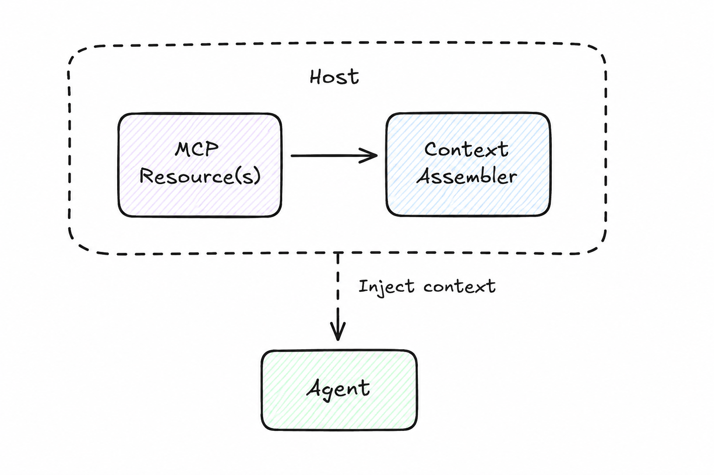

# Context Injection

> Supply an agent with relevant external context before it reasons, without the agent needing to fetch it.

**Category:** Context
**Maturity:** ★★ Established
**Also known as:** Context Augmentation, RAG Prefix, System Prompt Injection, MCP Resource Injection
**EIP Analog:** [Content Enricher](https://www.enterpriseintegrationpatterns.com/patterns/messaging/DataEnricher.html)

---

## Intent

Retrieve and assemble relevant external context — documents, records, history — and inject it into an agent's prompt before reasoning begins, so the agent focuses on reasoning rather than retrieval.

---

## Context

Agents are stateless by default. Each invocation starts with only what is in the prompt. When accurate answers require external facts, the pattern of supplying those facts ahead of the reasoning call — rather than during it — is Context Injection.

---

## Problem

An agent's reasoning quality depends on context: documents, user history, database records, prior conversation. Requiring agents to actively fetch every piece of context they need is slow, couples them to specific data sources, and often exceeds context window limits. Agents should focus on reasoning, not retrieval.

---

## Forces

- **F3 Token cost** — injecting large context windows increases cost per call; context must be selective, not exhaustive.
- **F4 Answer quality** — relevant context dramatically improves answer relevance and grounding; this is the pattern's entire value.
- **F8 Determinism** — the same context + same question → more reproducible answers than a context-free call.
- **F1 Latency** — fetching context from MCP resources adds a retrieval step before the LLM call.

---

## Solution

Before invoking an agent, a host or orchestrator retrieves relevant context from data sources (via MCP Resources or direct retrieval) and injects it into the agent's prompt or message. The agent receives pre-assembled context and focuses purely on reasoning over it.

---

## Diagram



---

## Participants

| Participant | Role |
|---|---|
| **Host / Orchestrator** | Receives the query, retrieves context, assembles the enriched prompt |
| **Data Sources** | Databases, document stores, APIs accessed via MCP Resources or direct calls |
| **Context Assembler** | Retrieves, ranks, and formats context to fit within the agent's context window |
| **Agent** | Receives the enriched prompt; reasons over pre-assembled context |

---

## Sample Code

Runnable implementation: [samples/python/context/context_injection.py](../../samples/python/context/context_injection.py)

```python
# RAG-style context injection using MCP Resources + LangChain
from langchain_anthropic import ChatAnthropic
from langchain_core.prompts import ChatPromptTemplate

async def answer_with_context(query: str, mcp_client) -> str:
    # Step 1: retrieve relevant context via MCP
    resources = await mcp_client.read_resource(f"docs://search?q={query}")
    context_text = "\n\n".join(r.text for r in resources.contents)

    # Step 2: inject context into prompt before invoking agent
    prompt = ChatPromptTemplate.from_messages([
        ("system", "Answer based only on the provided context.\n\nContext:\n{context}"),
        ("human", "{query}"),
    ])

    chain = prompt | ChatAnthropic(model="claude-sonnet-4-6")
    response = await chain.ainvoke({"context": context_text, "query": query})
    return response.content
```

---

## Consequences

- ✅ Dramatically improves answer relevance and grounding (F4 resolved)
- ✅ Reduces hallucination on facts available in context (F4)
- ✅ Agents stay stateless and focused on reasoning
- ✅ Context retrieval is controlled, auditable, and testable independently
- ✅ Same agent can work across different knowledge bases by changing the injected context
- ❌ Token cost grows with context size (F3 introduced)
- ❌ Context retrieval adds latency (F1 introduced)
- ❌ Stale context is worse than no context — freshness must be managed
- ❌ Host must know what context is relevant — retrieval quality determines reasoning quality

---

## When to Avoid

- When the question is purely generative and does not depend on specific facts.
- When context size consistently exceeds the model's effective window.
- When agents need to actively query data *during* reasoning — use [Tool Provider](tool-provider.md) instead.

---

## Failure Modes Mitigated

Per [FAILURE-MAP.md](../FAILURE-MAP.md):

- **FM-1.4 Loss of conversation history / context** ✅ — explicit context injection ensures the agent has the information it needs at every call.
- **FM-1.1 Disobey task specification** ◐ — injecting the task specification as context makes it harder to ignore.

---

## Known Uses

- **Anthropic Contextual Retrieval** — chunks documents with surrounding context before embedding, improving retrieval precision for injection.
- **Claude Desktop with MCP Resources** — the host reads MCP resources and injects them into the context window before each Claude invocation.
- **LangChain RAG chains** — the retriever runs before the LLM call; retrieved documents are formatted into the prompt.

---

## Related Patterns

- *complements* [Blackboard](../messaging/blackboard.md) — blackboard stores mutable shared state; context injection fetches read-only resources.
- *used-by* [Orchestrator](../coordination/orchestrator.md) — each step receives state injected from the orchestrator.
- *uses* [Tool Provider](tool-provider.md) — tools are the dynamic complement to static context injection.

---

## References

- Anthropic (2024). *Model Context Protocol specification.*
- Cemri, M. et al. (2025). *Why Do Multi-Agent LLM Systems Fail?* arXiv:2503.13657.
- [Anthropic: Contextual Retrieval](https://www.anthropic.com/research/contextual-retrieval)
- [MCP Resources Specification](https://modelcontextprotocol.io/docs/concepts/resources)
- Lewis et al. (2020). "Retrieval-Augmented Generation for Knowledge-Intensive NLP Tasks." NeurIPS 2020.
