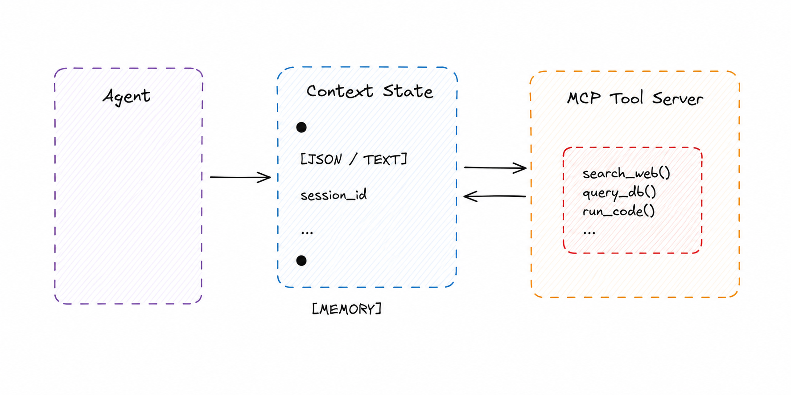

# Tool Provider

> Expose capabilities as invocable tools through a standardized interface, decoupling agents from specific implementations.

**Category:** Context
**Maturity:** ★★ Established
**Also known as:** MCP Server, Tool Server, Function Provider, Capability Provider
**EIP Analog:** [Service Activator](https://www.enterpriseintegrationpatterns.com/patterns/messaging/MessagingAdapter.html)

---

## Intent

Wrap agent capabilities — API calls, code execution, database queries — as MCP Tools with structured schemas, so that any agent can discover and invoke them without knowing the underlying implementation.

---

## Context

Agents need to act in the world beyond generating text. When those actions are hardcoded into the agent, they become fragile and non-reusable. The Tool Provider pattern externalizes actions into a separate server that the agent calls by name.

---

## Problem

Agents need to take actions in the world: query databases, call APIs, execute code, search the web, write files. Hardcoding these capabilities into agents makes them brittle, non-reusable, and hard to test. Different agents may need the same capability — duplicating the implementation is wasteful and inconsistent.

---

## Forces

- **F5 Blast radius** — the set of tools exposed defines the blast radius; exposing fewer, scoped tools limits damage from a compromised or misbehaving agent.
- **F10 Adaptability** — tools give the agent runtime capability beyond its training; new tools extend what the agent can do without retraining.
- **F11 Operational complexity** — each tool is an integration point that must be maintained, versioned, and secured.
- **F7 Trust asymmetry** — tool calls are executed with the tool server's permissions; an agent calling a destructive tool has those permissions for the duration of the call.

---

## Solution

Wrap capabilities as MCP Tools with structured input/output schemas. Agents discover available tools via `tools/list` and invoke them via `tools/call`. The Tool Provider handles execution and returns structured results. Agents remain unaware of implementation details — they only know the tool's name and schema.

---

## Diagram



---

## Participants

| Participant | Role |
|---|---|
| **Agent (MCP Client)** | Discovers and invokes tools; treats them as black boxes |
| **MCP Tool Server** | Hosts tool implementations; exposes `tools/list` and `tools/call` endpoints |
| **Tools** | Individual capability implementations (functions, API wrappers, scripts) |

---

## Sample Code

Runnable implementation: [samples/python/context/tool_provider.py](../../samples/python/context/tool_provider.py)

```python
# MCP Tool Server exposing web search and code execution
from mcp.server import Server
from mcp import types
import subprocess, httpx

app = Server("capability-server")

@app.list_tools()
async def list_tools() -> list[types.Tool]:
    return [
        types.Tool(
            name="search_web",
            description="Search the web and return top results as text",
            inputSchema={
                "type": "object",
                "properties": {"query": {"type": "string", "description": "Search query"}},
                "required": ["query"],
            },
        ),
        types.Tool(
            name="run_python",
            description="Execute Python code in a sandbox and return stdout",
            inputSchema={
                "type": "object",
                "properties": {"code": {"type": "string", "description": "Python code to run"}},
                "required": ["code"],
            },
        ),
    ]

@app.call_tool()
async def call_tool(name: str, arguments: dict) -> list[types.TextContent]:
    if name == "search_web":
        async with httpx.AsyncClient() as client:
            resp = await client.get(
                "https://api.search.example.com/search",
                params={"q": arguments["query"]},
            )
            return [types.TextContent(type="text", text=resp.json()["results"][0]["text"])]

    if name == "run_python":
        result = subprocess.run(
            ["python", "-c", arguments["code"]],
            capture_output=True, text=True, timeout=10
        )
        return [types.TextContent(type="text", text=result.stdout)]
```

---

## Consequences

- ✅ Agents are completely decoupled from tool implementations (F10)
- ✅ Tools can be versioned, replaced, or mocked independently of agents (F11)
- ✅ Any MCP-compatible agent can use any MCP tool server — framework agnostic (F10)
- ❌ Tool schemas must be carefully designed; poor descriptions and schemas confuse LLMs (F11)
- ❌ Tool explosion — too many tools in `tools/list` degrades agent performance and decision-making (F5)
- ❌ Tool calls add round-trip latency compared to in-process function calls
- ❌ Each tool is an integration point that must be secured and versioned (F7, F11)

---

## When to Avoid

- When the capability can be expressed as a static context injection — don't add tool infrastructure for read-only lookups.
- When every call requires the same tool with the same arguments — inline the logic.

---

## Failure Modes Mitigated

Per [FAILURE-MAP.md](../FAILURE-MAP.md):

- **FM-1.2 Disobey role specification** ◐ — scoped tool exposure limits an agent to tools appropriate for its role.
- **FM-2.3 Task derailment** ◐ — tool schema validation prevents the agent from calling tools with malformed arguments.

---

## Known Uses

- **Claude Desktop / Claude.ai** — MCP tool servers expose file system, databases, and APIs as tools that Claude invokes during conversation.
- **LangChain Tools** — the LangChain `@tool` decorator and `StructuredTool` follow the same interface pattern as MCP tools.
- **OpenAI Function Calling** — the original popularization of structured tool invocation by LLMs; MCP generalizes this across providers.

---

## Related Patterns

- *complements* [Least-Privilege Tool Scope](../security/least-privilege-tool-scope.md) — Tool Provider defines the available tools; Least-Privilege scopes which agent gets which subset.
- *complements* [Context Injection](context-injection.md) — tools provide dynamic capability; context injection provides static knowledge.
- *used-by* [Magentic Orchestration](../coordination/magentic.md) — specialists in Magentic are typically tool-equipped agents.

---

## References

- Anthropic (2024). *Model Context Protocol specification.*
- Sarkar, A. & Sarkar, S. (2025). *Survey of LLM Agent Communication with MCP.* arXiv:2506.05364.
- [MCP Tools Specification](https://modelcontextprotocol.io/docs/concepts/tools)
- [Anthropic: Building Effective Agents](https://www.anthropic.com/research/building-effective-agents)
