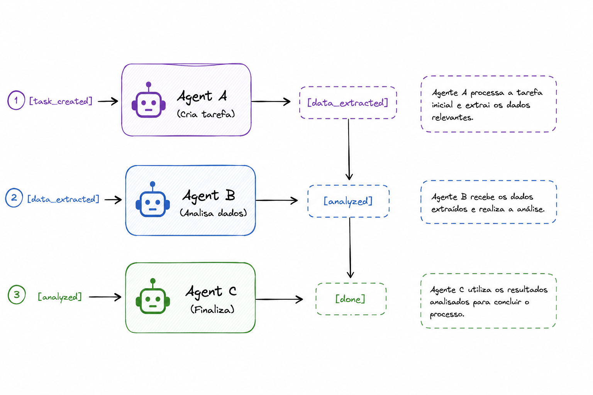

# Choreography
**Category:** Coordination
**Maturity:** ★★ Established
**Also known as:** Event-Driven Coordination, Decentralized Coordination, Reactive Agents

> Agents coordinate through events without a central controller — each agent knows what to do when it receives a specific event.

**EIP Analog:** [Event-Driven Consumer](https://www.enterpriseintegrationpatterns.com/patterns/messaging/EventDrivenConsumer.html)

---

## Intent

Enable agents to coordinate at scale without a central coordinator by having each agent react to events it subscribes to and publish events that trigger downstream agents.

---

## Context

Centralized orchestration creates bottlenecks and single points of failure. In high-scale or highly dynamic systems, agents need to coordinate without depending on a coordinator being alive. Adding new agents should not require modifying a central workflow definition.

---

## Problem

Centralized orchestration creates bottlenecks and single points of failure. In high-scale or highly dynamic systems, you need agents to coordinate without depending on a coordinator being alive. Adding new agents should not require modifying a central workflow definition.

---

## Forces

- **F9 Scalability vs. F6 Observability** — this is the core tension: choreography scales horizontally with no coordinator bottleneck (F9), but the global workflow is implicit and hard to trace (F6). This is the exact inverse of Orchestrator.
- **F2 Coupling** — agents are fully decoupled from each other; they only know the event schema, not each other's addresses.
- **F8 Determinism** — the emergent flow is harder to predict and test than a defined graph.

---

## Solution

Each agent subscribes to events relevant to its role and publishes events when it completes its work. No agent knows the global flow — each knows only its own triggers (input events) and outputs (published events). The workflow emerges from the interaction of locally-rational agents.

---

## Diagram



---

## Participants

| Participant | Role |
|---|---|
| **Event Agents** | Each subscribes to trigger events, does its work, publishes result events |
| **Event Bus / Broker** | Routes events to all interested subscribers (Kafka, Redis, NATS) |
| **Event Schema** | The contract between agents — what each event contains |

---

## Sample Code

Runnable implementation: [samples/python/coordination/choreography.py](../../samples/python/coordination/choreography.py)

```python
# Choreography using Redis Streams as the event bus
import asyncio
import redis.asyncio as redis
import json

r_client = None  # shared Redis client

async def agent_a_extract(stream_in="tasks", stream_out="extracted"):
    """Agent A: subscribes to 'tasks', publishes to 'extracted'"""
    r = await redis.from_url("redis://localhost")
    last_id = "0"
    while True:
        events = await r.xread({stream_in: last_id}, block=1000, count=1)
        for _, messages in events:
            for msg_id, data in messages:
                result = {"text": f"extracted from: {data[b'input'].decode()}"}
                await r.xadd(stream_out, result)
                last_id = msg_id

async def agent_b_analyze(stream_in="extracted", stream_out="analyzed"):
    """Agent B: subscribes to 'extracted', publishes to 'analyzed'"""
    r = await redis.from_url("redis://localhost")
    last_id = "0"
    while True:
        events = await r.xread({stream_in: last_id}, block=1000, count=1)
        for _, messages in events:
            for msg_id, data in messages:
                result = {"analysis": f"analyzed: {data[b'text'].decode()}"}
                await r.xadd(stream_out, result)
                last_id = msg_id

# Run agents independently (each in its own process in production)
async def main():
    await asyncio.gather(agent_a_extract(), agent_b_analyze())
```

---

## Consequences

**Benefits:**
- ✅ Highly decoupled (F2) — agents developed, deployed, and scaled independently
- ✅ No single point of failure in the coordination layer (F9)
- ✅ Easy to add new agents by subscribing to existing events

**Trade-offs:**
- ❌ Global workflow is implicit (F6) — understanding the full flow requires reading all agents
- ❌ Debugging failures requires distributed tracing across agents
- ❌ Compensating for partial failures (saga pattern) is complex without a coordinator (F8)

---

## When to Avoid

- When you need to audit a specific run's execution path — use Orchestrator.
- When distributed transactions and compensation are needed — use Saga / Compensating Action.
- When debugging emergent flow has too high an operational cost.

---

## Failure Modes Mitigated

Per [FAILURE-MAP.md](../FAILURE-MAP.md):
- **FM-2.4 Information withholding** ◐ — events are broadcast; all subscribers receive the information.

Note: choreography *introduces* FM-2.3 (task derailment) and FM-1.5 (unclear termination) risks compared to orchestration — factor this into architecture decisions.

---

## Known Uses

- **Kafka-backed agentic pipelines** — each agent is a consumer group on one topic and a producer on another; no coordinator needed
- **CrewAI event-driven flows** — task completion events trigger subscribed crew members without a central manager
- **Microservices-style agent sagas** — agents implement compensating transactions by subscribing to failure events

---

## Related Patterns

- *alternative-to* [Orchestrator](orchestrator.md) — inverts the F6/F9 trade-off exactly.
- *used-by* [Dead Letter Agent](../resilience/dead-letter-agent.md) — unhandled events route to the dead letter handler.
- *complements* [Blackboard](../messaging/blackboard.md) — events trigger agents; blackboard stores accumulated state.

---

## References

- Hohpe, G. & Woolf, B. (2003). *Enterprise Integration Patterns* — Event-Driven Consumer.
- Cemri, M. et al. (2025). arXiv:2503.13657.
- Richardson, C. (2018). *Microservices Patterns*. Manning. Chapter 4: Managing transactions with sagas.
- arXiv:2501.06322 — characterizes peer-to-peer (choreography) vs. centralized (orchestration) as a primary structural dimension.
