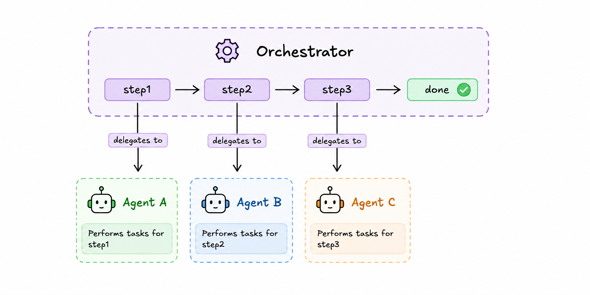

# Orchestrator

> A central coordinator defines the execution flow, sequences agent calls, and manages state — without monitoring individual agents at runtime.

**Category:** coordination
**EIP Analog:** [Process Manager](https://www.enterpriseintegrationpatterns.com/patterns/messaging/ProcessManager.html) (static variant)

---

## Also Known As

Workflow Coordinator, Agent Planner, Central Controller

---

## Problem

A workflow requires coordinating multiple agents in a defined sequence, but you need a single place to define the execution plan, manage state, and handle branching logic. Without a coordinator, each agent must know about the overall flow — coupling them to the workflow instead of their domain.

---

## Solution

The orchestrator holds the workflow definition as a graph or plan. It calls agents in sequence or in parallel according to the plan, passes state between steps, and handles conditional branching. Unlike the Supervisor, the orchestrator follows a pre-defined plan rather than dynamically monitoring and reacting at runtime.

---

## Diagram



---

## Participants

| Participant | Role |
|---|---|
| **Orchestrator** | Holds the workflow graph; sequences calls; passes state between steps |
| **Worker Agents** | Execute individual steps; unaware of the overall workflow |
| **State Store** | Holds workflow state between steps (in-memory, Redis, DB) |

---

## Consequences

**Benefits:**
- ✅ Predictable execution — workflow is explicit and auditable
- ✅ Centralized state management — no state scattered across agents
- ✅ Easy to test — workflow and agents are independently testable

**Trade-offs:**
- ❌ Orchestrator becomes a maintenance point when workflows change
- ❌ Less adaptive than Choreography for dynamic or unpredictable scenarios
- ❌ Orchestrator state is a single point of failure unless externalized

---

## Implementation

```python
# LangGraph StateGraph as orchestrator
from langgraph.graph import StateGraph, END
from langgraph.checkpoint.sqlite import SqliteSaver
from typing import TypedDict

class WorkflowState(TypedDict):
    input: str
    plan: list[str]
    results: list[str]
    final: str

def planner(state: WorkflowState) -> WorkflowState:
    return {"plan": ["research", "draft", "review"]}

def researcher(state: WorkflowState) -> WorkflowState:
    return {"results": [f"research result for: {state['input']}"]}

def drafter(state: WorkflowState) -> WorkflowState:
    return {"results": state["results"] + ["draft based on research"]}

def reviewer(state: WorkflowState) -> WorkflowState:
    return {"final": f"Reviewed: {state['results'][-1]}"}

# The StateGraph IS the orchestrator
graph = StateGraph(WorkflowState)
graph.add_node("plan", planner)
graph.add_node("research", researcher)
graph.add_node("draft", drafter)
graph.add_node("review", reviewer)

graph.set_entry_point("plan")
graph.add_edge("plan", "research")
graph.add_edge("research", "draft")
graph.add_edge("draft", "review")
graph.add_edge("review", END)

# Checkpointer externalizes state (makes orchestrator fault-tolerant)
memory = SqliteSaver.from_conn_string(":memory:")
app = graph.compile(checkpointer=memory)
```

---

## Known Uses

- **LangGraph StateGraph** — the primary abstraction; the graph definition is the orchestrator
- **Azure Semantic Kernel Planners** — Stepwise and Handlebars planners generate and execute multi-step agent plans
- **Anthropic's "Orchestrator-Subagents" pattern** — documented in Building Effective Agents; one agent generates a plan, subagents execute each step

---

## Related Patterns

- [Supervised Delegation](./supervised-delegation.md) — adds runtime monitoring and dynamic replanning on top of orchestration
- [Choreography](./choreography.md) — decentralized alternative; no coordinator needed
- [Checkpoint & Resume](../resilience/checkpoint-resume.md) — externalize orchestrator state to survive failures

---

## References

- [Anthropic: Orchestrator-Subagents Pattern](https://www.anthropic.com/research/building-effective-agents)
- [LangGraph: How it Works](https://langchain-ai.github.io/langgraph/concepts/low_level/)
- arXiv:2508.01186 — surveys orchestration flows as a primary axis for classifying agent workflow systems
