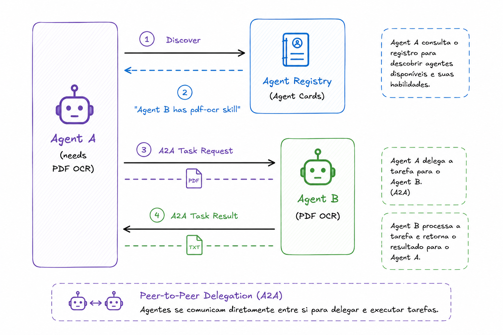

# Peer-to-Peer Delegation (A2A)
**Category:** Coordination
**Maturity:** ★ Emerging
**Also known as:** Agent Handoff, Lateral Delegation, Capability-Negotiated Delegation

> An agent directly delegates a subtask to another agent through a capability-negotiated channel, without involving a central coordinator.

**EIP Analog:** [Messaging Gateway](https://www.enterpriseintegrationpatterns.com/patterns/messaging/MessagingGateway.html) (dynamic variant)

---

## Intent

Allow agents to autonomously discover capable peers and delegate subtasks at runtime without a central coordinator, enabling cross-framework interoperability and horizontal scalability.

---

## Context

An agent discovers mid-execution that a subtask requires capabilities it does not possess. A central coordinator may not exist, may be unavailable, or the delegation decision can only be made with context available locally to the delegating agent.

---

## Problem

An agent discovers mid-execution that a subtask requires capabilities it does not possess. A central coordinator may not exist, may be unavailable, or the delegation decision can only be made with context available locally to the delegating agent. The agent needs to find and delegate to a capable peer autonomously.

---

## Forces

- **F2 Coupling** — no central coordinator; agents discover peers by capability, not address, keeping the mesh loosely coupled.
- **F10 Adaptability** — agents can delegate dynamically based on runtime discovery; the system adapts to what peers are available.
- **F7 Trust asymmetry** — every A2A delegation is a trust decision; without explicit trust tiers, a compromised agent can delegate to the core.
- **F11 Operational complexity** — discovery overhead per delegation + trust establishment between every agent pair adds operational cost.

---

## Solution

Using Agent Card discovery, the delegating agent queries the registry for an agent with the required capability. It establishes an A2A channel directly with the discovered peer, sends the task with relevant context, and awaits the result. The delegating agent resumes its own work once the result is received — no coordinator involved.

---

## Diagram



---

## Participants

| Participant | Role |
|---|---|
| **Delegating Agent** | Identifies the need, discovers the peer, delegates, awaits result |
| **Agent Registry** | Resolves capability queries to agent endpoints |
| **Peer Agent** | Receives the delegated task, executes it, returns the result |

---

## Sample Code

Runnable implementation: [samples/python/coordination/peer_to_peer_delegation.py](../../samples/python/coordination/peer_to_peer_delegation.py)

```python
# Peer-to-peer delegation using the A2A Python client
import httpx
from a2a.client import A2AClient
from a2a.types import SendTaskRequest

async def discover_and_delegate(capability: str, task_text: str) -> str:
    # Step 1: discover peer with needed capability
    async with httpx.AsyncClient() as http:
        resp = await http.get(
            "https://registry.example.com/agents",
            params={"skill": capability},
        )
        peer_url = resp.json()[0]["url"]

    # Step 2: fetch Agent Card to verify capability and get auth info
    peer_card = await http.get(f"{peer_url}/.well-known/agent.json")

    # Step 3: delegate via A2A
    client = A2AClient(url=peer_url)
    request = SendTaskRequest(
        id=f"delegated-{capability}-001",
        message={
            "role": "user",
            "parts": [{"type": "text", "text": task_text}],
        },
    )

    response = await client.send_task(request)
    return response.result.status.message.parts[0].text


# Usage inside a larger agent
async def main_agent_task(document_url: str):
    # Main agent realizes it needs OCR mid-task
    ocr_result = await discover_and_delegate(
        capability="pdf-ocr",
        task_text=f"Extract text from PDF at: {document_url}",
    )
    # Continue with the OCR result
    return analyze_text(ocr_result)
```

---

## Consequences

**Benefits:**
- ✅ No coordinator bottleneck (F9) — delegation scales horizontally
- ✅ Agents remain autonomous (F10); composition happens at runtime based on actual needs
- ✅ Works across framework boundaries (F2) — LangGraph agent can delegate to an AutoGen agent via A2A

**Trade-offs:**
- ❌ Discovery overhead per delegation adds latency (F11)
- ❌ Trust must be established between every agent pair at runtime (F7)
- ❌ Debugging delegations across agents requires distributed tracing

---

## When to Avoid

- When a supervisor should control all delegation — use Supervised Delegation.
- When trust between agent pairs cannot be managed — a compromised peer poisons the delegation chain.

---

## Failure Modes Mitigated

Per [FAILURE-MAP.md](../FAILURE-MAP.md):
- **FM-1.2 Disobey role specification** ◐ — capability-based peer discovery routes to agents with the declared role.

---

## Known Uses

- **Google A2A Protocol** — the primary use case for A2A is peer-to-peer delegation: agents delegate to other A2A-compliant agents discovered via Agent Cards
- **Salesforce Agentforce** — agents in Agentforce flows can delegate sub-tasks to specialized agents in the same ecosystem
- **Spring AI multi-agent flows** — Spring AI supports A2A delegation between independently deployed Spring AI agents

---

## Related Patterns

- *uses* [Agent Card Registry](../discovery/agent-card-registry.md) — to discover capable peers.
- *alternative-to* [Supervised Delegation](supervised-delegation.md) — no supervisor; agents self-organize.
- *complements* [Trust Boundary](../security/trust-boundary.md) — trust tiers are essential when peer delegation crosses security zones.

---

## References

- Google (2025). *A2A Protocol Specification.*
- Cemri, M. et al. (2025). arXiv:2503.13657.
- [A2A Protocol Specification](https://a2a-protocol.org/specification/latest/Agent-to-Agent%20Protocol%20Specification)
- [Google Developer Blog: A2A Launch](https://developers.googleblog.com/en/a2a-a-new-era-of-agent-interoperability/)
- arXiv:2501.06322 — peer-to-peer structure is one of three primary coordination structures in multi-agent LLM systems.
