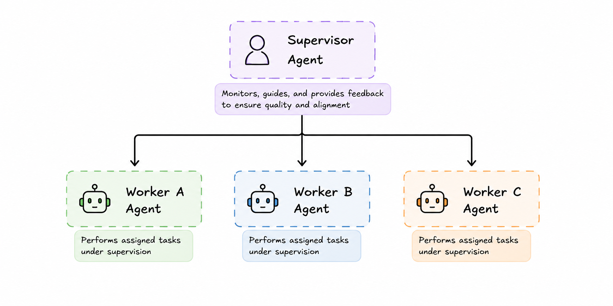

# Supervised Delegation
**Category:** Coordination
**Maturity:** ★★ Established
**Also known as:** Supervisor-Worker, Manager-Worker, Hierarchical Delegation

> A supervisor agent decomposes a goal into subtasks, delegates each to a specialist agent, monitors execution, and intervenes on failure.

**EIP Analog:** [Process Manager](https://www.enterpriseintegrationpatterns.com/patterns/messaging/ProcessManager.html)

---

## Intent

Coordinate multiple specialist agents toward a complex goal while maintaining coherence, fault tolerance, and visibility — with a single agent that owns the plan and monitors its execution.

---

## Context

Complex goals exceed any single agent's capacity and benefit from specialization. Subtasks must be distributed across agents while the overall goal remains coherent. Failures in subtasks must be handled, retried, or escalated without losing global state.

---

## Problem

Complex goals exceed any single agent's capacity and benefit from specialization. But tasks need to be distributed while the overall goal remains coherent — failures in subtasks must be handled, retried, or escalated without losing the global state.

---

## Forces

- **F4 Answer quality / F6 Observability** — the supervisor monitors outcomes and can retry, escalate, or reassign on failure; the overall goal remains coherent.
- **F9 Scalability vs. F6** — the supervisor is a bottleneck and single point of coordination; it provides observability at the cost of throughput.
- **F10 Adaptability** — the supervisor can dynamically re-plan when a worker fails, unlike a fixed Orchestrator.

---

## Solution

A supervisor agent owns the high-level goal and maintains a plan. It decomposes the goal into subtasks, assigns each to a specialist worker agent, and monitors their execution. When a worker fails, the supervisor retries with the same or a different agent, adjusts the plan, or escalates to a human. The supervisor never executes domain tasks itself.

---

## Diagram



---

## Participants

| Participant | Role |
|---|---|
| **Supervisor Agent** | Decomposes goals, assigns tasks, monitors workers, handles failures |
| **Worker Agents** | Execute assigned subtasks; report results or failures to the supervisor |
| **Human Escalation** | Receives tasks the supervisor cannot resolve autonomously |

---

## Sample Code

Runnable implementation: [samples/python/coordination/supervised_delegation.py](../../samples/python/coordination/supervised_delegation.py)

```python
# LangGraph Supervisor pattern
from langgraph.graph import StateGraph, END
from langgraph_supervisor import create_supervisor
from langchain_anthropic import ChatAnthropic

llm = ChatAnthropic(model="claude-sonnet-4-6")

# Define worker agents
from langchain_core.tools import tool

@tool
def research_topic(topic: str) -> str:
    """Research a topic and return findings."""
    return f"Research findings for: {topic}"

@tool
def write_section(content: str, section: str) -> str:
    """Write a report section based on content."""
    return f"Section '{section}' written with content: {content[:100]}..."

# Supervisor routes between workers and synthesizes
supervisor = create_supervisor(
    llm=llm,
    agents=["researcher", "writer"],
    prompt=(
        "You are a supervisor coordinating a research report. "
        "First have the researcher gather information, then have the writer produce sections. "
        "If a worker fails, retry once before escalating."
    ),
)
```

---

## Consequences

**Benefits:**
- ✅ Clear accountability (F6) — supervisor owns the goal end-to-end
- ✅ Fault tolerance (F10) — supervisor can retry, reassign, or restructure the plan on failure
- ✅ Workers stay focused on their domain; the supervisor handles coordination complexity (F4)

**Trade-offs:**
- ❌ Supervisor is a single point of failure and bottleneck (F9)
- ❌ Supervisor quality (LLM quality + prompt quality) determines overall system quality (F4)
- ❌ Requires careful prompt design to avoid infinite retry loops

---

## When to Avoid

- When the plan is fixed and failures are rare — use Orchestrator (simpler, no monitoring loop).
- When the supervisor becomes a bottleneck — consider Choreography for scale.

---

## Failure Modes Mitigated

Per [FAILURE-MAP.md](../FAILURE-MAP.md):
- **FM-2.2 Fail to ask for clarification** ◐ — the supervisor can detect when a worker is stuck and provide clarification.
- **FM-3.1 Premature termination** ◐ — the supervisor verifies worker completion before declaring the goal done.

---

## Known Uses

- **AWS Bedrock Multi-Agent Supervisor** — a dedicated supervisor agent decomposes requests and routes to registered sub-agents, monitoring completion and handling errors
- **AutoGen GroupChatManager** — orchestrates agent conversations, decides who speaks next, and handles termination conditions
- **LangGraph Supervisor Pattern** — documented pattern using conditional edges from a supervisor node to worker nodes

---

## Related Patterns

- *alternative-to* [Orchestrator](orchestrator.md) — adds runtime monitoring; choose when the plan must adapt to failures.
- *alternative-to* [Magentic Orchestration](magentic.md) — monitored but pre-decomposed; Magentic re-decomposes at runtime.
- *uses* [Direct Message](../messaging/direct-message.md) — supervisor delegates via direct messages to workers.
- *uses* [Dead Letter Agent](../resilience/dead-letter-agent.md) — escalation target when a worker fails all retries.

---

## References

- Anthropic (2024). *Building Effective Agents* — Orchestrator-subagents.
- Cemri, M. et al. (2025). arXiv:2503.13657.
- Hohpe & Woolf (2003). *Enterprise Integration Patterns*: Process Manager.
- [LangGraph Supervisor Tutorial](https://langchain-ai.github.io/langgraph/tutorials/multi_agent/agent_supervisor/)
- arXiv:2501.06322 — classifies hierarchical structures as a primary multi-agent coordination dimension.
