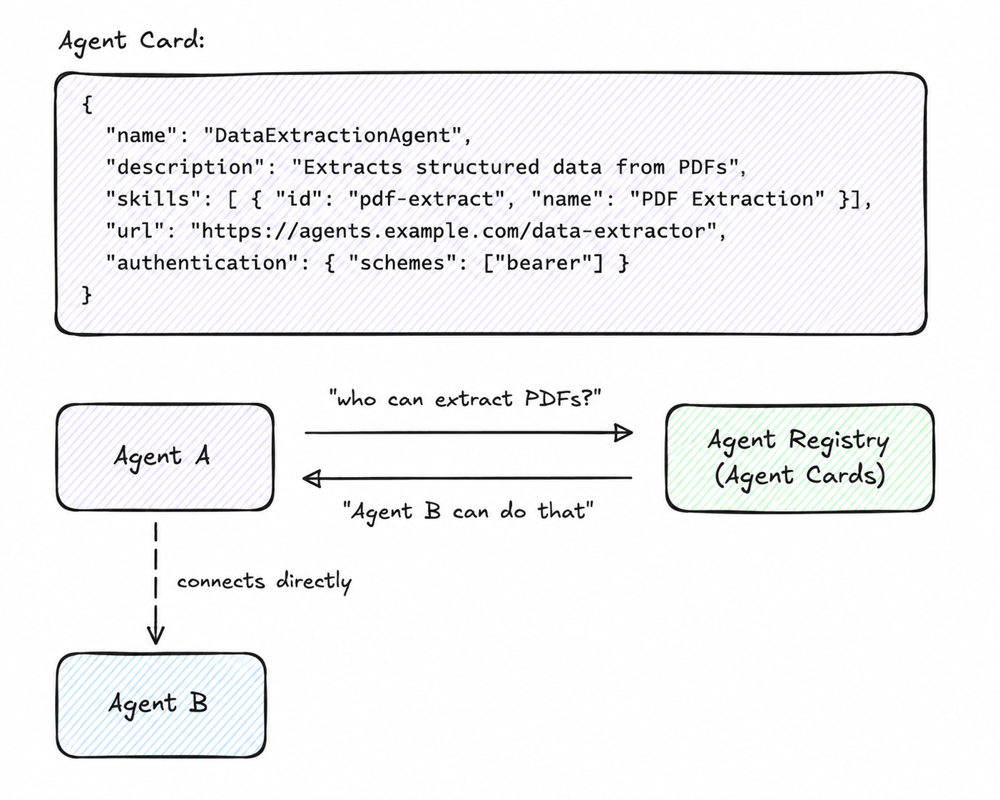

# Agent Card Registry

**Category:** Discovery
**Maturity:** ★★ Established
**Also known as:** Service Registry, Capability Registry, Agent Directory, Well-Known Endpoint

---

## Intent

Allow agents to advertise their capabilities and be discovered by other agents at runtime without prior configuration.

---

## Context

In a dynamic multi-agent system, the set of available agents changes continuously. New agents join, capabilities evolve, and agents may be versioned or temporarily unavailable. Routing decisions must happen at runtime based on current, live capability information — not static configuration.

---

## Problem

You cannot hardcode which agent handles which task when agent deployment is dynamic. Callers need a way to find an agent that can satisfy a capability requirement without knowing its address in advance, and without a human operator reconfiguring the system each time an agent is added or replaced.

---

## Forces

- **F2 Coupling** — the registry is an indirection layer: callers discover agents by capability, not by address, decoupling them from deployment topology.
- **F11 Operational complexity** — the registry itself becomes infrastructure that must be kept current; stale entries are worse than no entry.
- **F9 Scalability** — new agents register themselves; no central reconfiguration needed.
- **F10 Adaptability** — agents can be replaced or upgraded transparently if they maintain the same Agent Card capabilities.

---

## Solution

Each agent publishes an **Agent Card** — a structured capability manifest — at a well-known endpoint (`/.well-known/agent.json`). A registry indexes these cards. When an agent or orchestrator needs a capability, it queries the registry and receives a list of agents that can fulfill the request, along with their endpoints and authentication requirements.

---

## Diagram



---

## Participants

| Participant | Role |
|---|---|
| **Agent** | Publishes its Agent Card at a well-known URL; keeps it updated |
| **Registry** | Indexes Agent Cards; answers capability queries |
| **Consumer Agent** | Queries the registry for needed capabilities; connects directly to the discovered agent |

---

## Sample Code

Runnable implementation: [samples/python/discovery/agent_card_registry.py](../../samples/python/discovery/agent_card_registry.py)

```python
# Serving an Agent Card (A2A spec)
from fastapi import FastAPI
from a2a.types import AgentCard, AgentSkill, AgentCapabilities

app = FastAPI()

AGENT_CARD = AgentCard(
    name="ResearchAgent",
    description="Searches the web and synthesizes information on any topic",
    url="https://agents.example.com/research",
    version="1.0.0",
    skills=[
        AgentSkill(
            id="web-research",
            name="Web Research",
            description="Search and synthesize information from the web",
            inputModes=["text"],
            outputModes=["text"],
        )
    ],
    capabilities=AgentCapabilities(streaming=True),
    defaultInputModes=["text"],
    defaultOutputModes=["text"],
)

@app.get("/.well-known/agent.json")
async def get_agent_card():
    return AGENT_CARD.model_dump(exclude_none=True)


# Discovering agents (consumer side)
import httpx

async def find_agent_with_skill(registry_url: str, skill_id: str) -> str:
    async with httpx.AsyncClient() as client:
        resp = await client.get(f"{registry_url}/agents?skill={skill_id}")
        agents = resp.json()
        return agents[0]["url"]  # return first matching agent's URL
```

---

## Consequences

**Benefits:**

- Dynamic composition — agents join and leave without global reconfiguration *(resolves F9 Scalability)*
- Capability-based routing — consumers find agents by what they can do, not by name *(resolves F2 Coupling)*
- Enables multi-framework interoperability (LangGraph agents discoverable by AutoGen agents) *(resolves F10 Adaptability)*

**Trade-offs:**

- Registry becomes a single point of failure; requires high availability *(amplifies F11 Operational complexity)*
- Stale cards if agents fail without deregistering *(amplifies F11 Operational complexity)*
- Trust verification of discovered agents requires additional security layers

---

## When to avoid

- When the set of agents is fixed and known at design time — hard-code the addresses and skip the registry overhead.
- When registry staleness cannot be managed — a stale registry causes silent misrouting, worse than no discovery.

---

## Failure Modes Mitigated

Per [FAILURE-MAP.md](../FAILURE-MAP.md):

- **FM-1.2 Disobey role specification** ◐ — capability-based discovery routes tasks to agents registered for the correct role, reducing misrouting.
- **FM-2.3 Task derailment** ◐ — a task reaches an agent with the declared capability, reducing derailment from wrong-agent execution.

---

## Known Uses

- **Google A2A Protocol** — defines the Agent Card schema and `/.well-known/agent.json` convention as the standard discovery mechanism
- **AWS Bedrock Agent Aliases** — agents are registered with capability metadata and discovered by orchestration layers
- **Azure AI Foundry** — agent catalog provides capability-based discovery across deployed agent resources

---

## Related Patterns

- *used-by* [Agent Proxy](agent-proxy.md) — the proxy discovers the backend via the registry.
- *used-by* [Peer-to-Peer Delegation](../coordination/peer-to-peer-delegation.md) — agents use the registry to find capable peers.
- *used-by* [Content-Based Router](../routing/content-based-router.md) — the router resolves capability to agent address via the registry.

---

## References

- Google (2025). *A2A Protocol* — Agent Card specification (/.well-known/agent.json).
- Sarkar, A. & Sarkar, S. (2025). *Survey of LLM Agent Communication with MCP.* arXiv:2506.05364.
- [A2A Agent Card Specification](https://a2a-protocol.org/specification/latest/Agent-to-Agent%20Protocol%20Specification#agent-card)
- Google Developer Blog: [A2A: A New Era of Agent Interoperability](https://developers.googleblog.com/en/a2a-a-new-era-of-agent-interoperability/)
