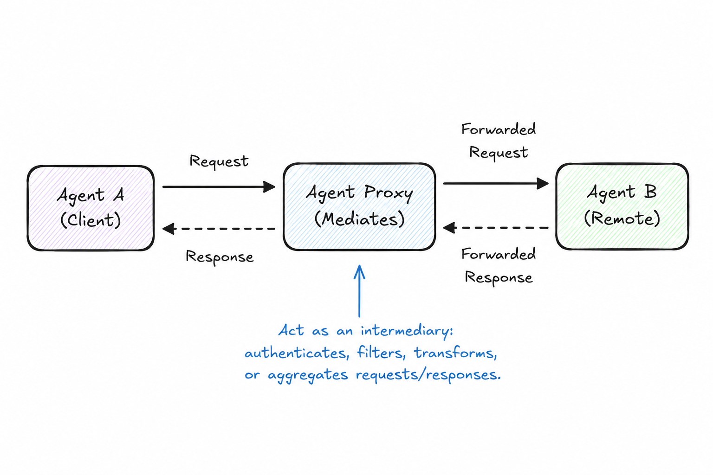

# Agent Proxy

> Provide a stable interface to an agent (or group of agents) while hiding implementation details, protocol differences, or versioning.

**Category:** discovery
**EIP Analog:** [Messaging Gateway](https://www.enterpriseintegrationpatterns.com/patterns/messaging/MessagingGateway.html)

---

## Also Known As

Agent Gateway, Agent Facade, Protocol Adapter

---

## Problem

Consumers of an agent's capabilities should not need to know whether the agent is a single LLM call, a sub-graph of agents, an external API, or which protocol it speaks. Exposing implementation details forces consumers to change when the implementation changes. You also need a single place to handle versioning, load balancing, authentication, and protocol translation.

---

## Solution

Introduce a proxy agent that presents a uniform interface. The proxy translates protocols (e.g., A2A ↔ MCP), routes to appropriate backend agents, manages versioning, and handles cross-cutting concerns like authentication and rate limiting. Consumers interact only with the proxy.

---

## Diagram



---

## Participants

| Participant | Role |
|---|---|
| **Consumer Agent** | Uses the proxy as if it were the real agent; protocol-agnostic |
| **Proxy** | Presents a uniform interface; handles translation, auth, routing, and versioning |
| **Backend(s)** | The real agent(s) or tool(s) that do the actual work |

---

## Consequences

**Benefits:**
- ✅ Decouples consumers from implementation — swap backends without touching consumers
- ✅ Single place for cross-cutting concerns: auth, logging, rate limiting, circuit breaking
- ✅ Enables A/B testing and gradual migration between agent versions

**Trade-offs:**
- ❌ Adds a network hop and latency
- ❌ The proxy itself becomes a bottleneck if it holds state
- ❌ Protocol translation is complex and can introduce subtle semantic mismatches

---

## Implementation

```python
# MCP proxy server that wraps an A2A agent as an MCP tool
from mcp.server import Server
from mcp.server.models import InitializationOptions
from mcp import types
from a2a.client import A2AClient

app = Server("agent-proxy")
a2a_client = A2AClient(url="https://agents.example.com/research")

@app.list_tools()
async def list_tools() -> list[types.Tool]:
    return [
        types.Tool(
            name="research",
            description="Search and synthesize information on any topic",
            inputSchema={
                "type": "object",
                "properties": {"query": {"type": "string"}},
                "required": ["query"],
            },
        )
    ]

@app.call_tool()
async def call_tool(name: str, arguments: dict) -> list[types.TextContent]:
    if name == "research":
        # Translate MCP tool call → A2A task request
        result = await a2a_client.send_task_and_wait(
            message=arguments["query"]
        )
        return [types.TextContent(type="text", text=result.text)]
```

---

## Known Uses

- **LangGraph remote agent nodes** — LangGraph can expose a sub-graph as a remote agent endpoint, acting as a proxy to a complex internal workflow
- **MCP proxy servers** — proxy servers that aggregate multiple MCP tool servers behind a single endpoint
- **API gateways for agent endpoints** — cloud-hosted gateways (AWS API Gateway, Azure APIM) acting as proxies to agent services

---

## Related Patterns

- [Agent Card Registry](./agent-card-registry.md) — the proxy registers itself in the registry, abstracting the real backends
- [Circuit Breaker](../resilience/circuit-breaker.md) — implement circuit breaking inside the proxy to protect consumers from backend failures
- [Direct Message](../messaging/direct-message.md) — consumers send Direct Messages to the proxy, not to the backend

---

## References

- Hohpe & Woolf (2003). *Enterprise Integration Patterns*: Messaging Gateway
- [MCP Proxy Servers](https://modelcontextprotocol.io/docs/concepts/architecture)
