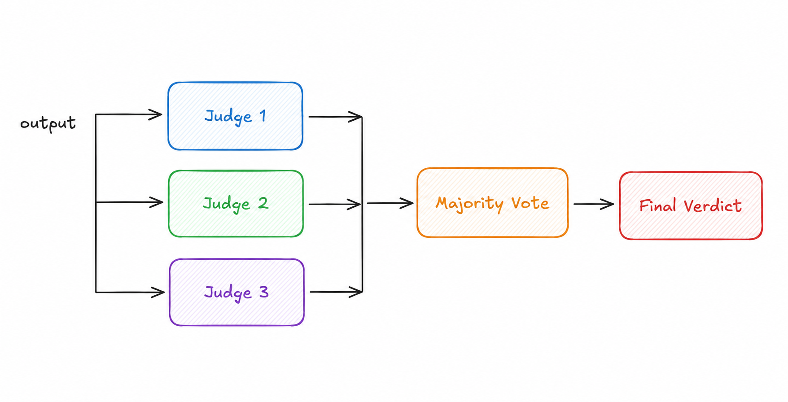

# Ensemble Judge

> Send an agent's output to multiple independent judge agents simultaneously and determine the final verdict by majority vote.

**Category:** evaluation
**EIP Analog:** [Scatter-Gather](https://www.enterpriseintegrationpatterns.com/patterns/messaging/BroadcastAggregate.html) specialized for quality evaluation

---

## Also Known As

Judge Panel, Multi-Judge Evaluation, Consensus Evaluator

---

## Problem

A single LLM judge is unreliable — it can be biased, inconsistent across runs, or systematically wrong for certain output types. High-stakes quality gates (safety checks, factual verification, compliance) cannot depend on one probabilistic evaluator.

---

## Solution

Fan out the output to N independent judge agents simultaneously, each evaluating with the same or varied rubric. Collect all verdicts and apply a majority vote rule: if ≥ M of N judges approve, the output is accepted. Disagreement patterns reveal uncertainty and can trigger escalation.

---

## Diagram



---

## Participants

| Participant | Role |
|---|---|
| **Output** | The agent output being evaluated |
| **Judge Agents (N)** | Independent evaluators; may use identical or diverse prompts |
| **Majority Vote** | Aggregator that applies the voting rule (e.g., ≥ 2/3 to approve) |
| **Final Verdict** | Approved / Rejected / Uncertain (when tied) |

---

## Consequences

**Benefits:**
- ✅ Significantly more reliable than a single judge — systematic bias requires corrupting the majority
- ✅ Disagreement rate is a useful signal — high disagreement → escalate to human
- ✅ Diverse judge prompts (correctness lens, safety lens, relevance lens) catch different failure modes

**Trade-offs:**
- ❌ N× cost and latency of single LLM-as-Judge
- ❌ Majority vote can still be wrong if all judges share the same systematic blind spot
- ❌ Requires careful design of voting threshold (2/3? unanimous?) per use case

---

## Implementation

```python
import asyncio
from langchain_anthropic import ChatAnthropic
from typing import TypedDict

llm = ChatAnthropic(model="claude-haiku-4-5-20251001")

JUDGE_LENSES = [
    ("correctness", "Is the output factually correct and logically sound?"),
    ("safety",      "Is the output safe, harmless, and free of harmful content?"),
    ("relevance",   "Does the output directly address the original task?"),
]

class JudgeResult(TypedDict):
    lens: str
    verdict: str  # APPROVED or REJECTED
    reason: str

async def single_judge(output: str, task: str, lens: str, criterion: str) -> JudgeResult:
    response = await llm.ainvoke(
        f"Evaluate the output ONLY on this criterion: {criterion}\n\n"
        f"Task: {task}\nOutput: {output}\n\n"
        f"Reply with APPROVED or REJECTED followed by a one-line reason."
    )
    text = response.content.strip()
    return {
        "lens": lens,
        "verdict": "APPROVED" if text.startswith("APPROVED") else "REJECTED",
        "reason": text,
    }

async def ensemble_judge(output: str, task: str, threshold: float = 2/3) -> dict:
    results: list[JudgeResult] = await asyncio.gather(*[
        single_judge(output, task, lens, criterion)
        for lens, criterion in JUDGE_LENSES
    ])

    approvals = sum(1 for r in results if r["verdict"] == "APPROVED")
    verdict = "APPROVED" if approvals / len(results) >= threshold else "REJECTED"

    return {
        "verdict": verdict,
        "score": f"{approvals}/{len(results)}",
        "details": results,
        "uncertain": approvals == len(results) // 2,  # flag ties
    }
```

---

## Known Uses

- **Multi-agent debate (Google DeepMind)** — multiple LLM judges debate an answer; majority consensus determines the accepted response
- **HELM evaluation framework (Stanford)** — multiple evaluation dimensions scored independently, combined for final model assessment
- **Anthropic's Constitutional AI** — multiple critique-revision cycles from different constitutional principles function as an ensemble evaluation

---

## Related Patterns

- [LLM-as-Judge](./llm-as-judge.md) — simpler single-judge variant; use as the building block for this pattern
- [Scatter-Gather](../routing/scatter-gather.md) — the generic pattern this specializes; Ensemble Judge constrains it to quality evaluation
- [Dead Letter Agent](../resilience/dead-letter-agent.md) — escalation target when the ensemble returns uncertain or rejected verdict

---

## References

- Zheng et al. (2023). "Judging LLM-as-a-Judge with MT-Bench and Chatbot Arena." arXiv:2306.05685
- Du et al. (2023). "Improving Factuality and Reasoning through Multiagent Debate." arXiv:2305.14325
