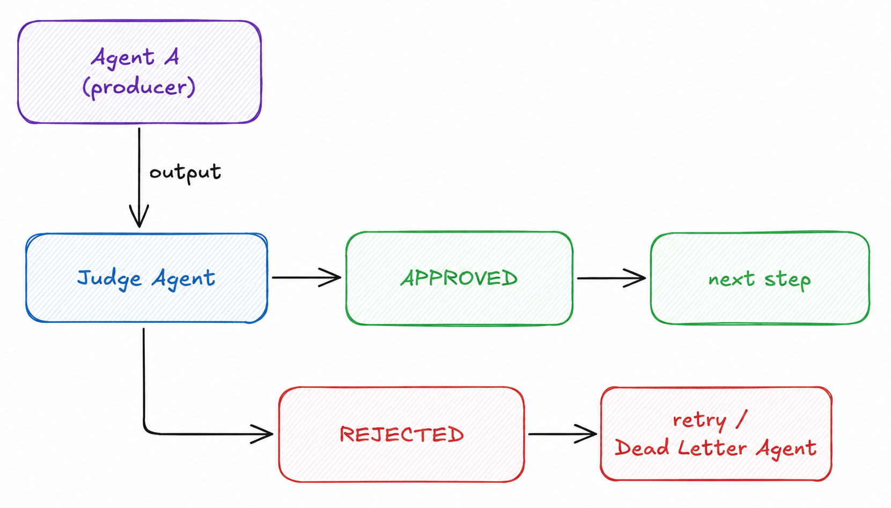

# LLM-as-Judge

> Route an agent's output through a dedicated judge agent that evaluates quality and decides whether to approve, reject, or escalate.

**Category:** Evaluation
**Maturity:** ★★ Established
**EIP Analog:** [Message Validator](https://www.enterpriseintegrationpatterns.com/patterns/messaging/MessageValidator.html) + [Content-Based Router](https://www.enterpriseintegrationpatterns.com/patterns/messaging/ContentBasedRouter.html)
**Also known as:** Evaluator Agent, Quality Gate, Auto-Reviewer, Reflection

---

## Intent

Introduce an independent LLM invocation dedicated solely to evaluating another agent's output against defined criteria, returning an explicit verdict and reason that can drive routing decisions (approve, retry, escalate).

---

## Context

Agents produce outputs that may be incorrect, incomplete, off-topic, or unsafe. Direct use of unverified output in downstream steps propagates errors silently. Human review of every response is too slow and expensive at scale.

---

## Problem

An agent produces output that may be incorrect, incomplete, or unsafe. You cannot trust the output blindly, but human review of every response is too slow and expensive. You need an automated quality gate between production and consumption.

---

## Forces

- **F4 Answer quality / Reliability** — automated quality gates are scalable; human review is not. The LLM judge is the tradeoff point.
- **F1 Latency / F3 Token cost** — every evaluated output requires one additional LLM call; this is the pattern's fixed cost.
- **F8 Determinism** — judge verdicts can be inconsistent across runs; this is the pattern's main liability (mitigated by Ensemble Judge).
- **F6 Observability** — the judge's verdict and reason are explicit, loggable, and auditable.

---

## Solution

Route the agent's output through a Judge Agent — a separate LLM invocation with a focused evaluation prompt. The judge scores or classifies the output and routes accordingly: approved outputs proceed to the next step; rejected outputs trigger a retry or escalate to the [Dead Letter Agent](../resilience/dead-letter-agent.md).

---

## Diagram



---

## Participants

| Participant | Role |
|---|---|
| **Producer Agent** | Generates the output to be evaluated |
| **Judge Agent** | Evaluates the output against defined criteria; returns verdict + reasoning |
| **Next Step** | Consumes approved output |
| **Retry / Dead Letter Agent** | Handles rejected output |

---

## Sample Code

Runnable implementation: [samples/python/evaluation/llm_as_judge.py](../../samples/python/evaluation/llm_as_judge.py)

```python
from langchain_anthropic import ChatAnthropic
from langgraph.graph import StateGraph, END
from typing import TypedDict, Literal

llm = ChatAnthropic(model="claude-sonnet-4-6")
judge_llm = ChatAnthropic(model="claude-haiku-4-5-20251001")  # fast, cheap judge

class JudgeState(TypedDict):
    task: str
    output: str
    verdict: str
    retries: int

def producer_agent(state: JudgeState) -> JudgeState:
    response = llm.invoke(state["task"])
    return {"output": response.content}

def judge_agent(state: JudgeState) -> JudgeState:
    verdict = judge_llm.invoke(
        f"Evaluate this output for the task.\n\n"
        f"Task: {state['task']}\n"
        f"Output: {state['output']}\n\n"
        f"Reply with exactly APPROVED or REJECTED, then a one-line reason."
    )
    verdict_text = verdict.content.strip()
    return {"verdict": "APPROVED" if verdict_text.startswith("APPROVED") else "REJECTED"}

def route_verdict(state: JudgeState) -> Literal["approved", "retry", "dead_letter"]:
    if state["verdict"] == "APPROVED":
        return "approved"
    if state.get("retries", 0) < 2:
        return "retry"
    return "dead_letter"

graph = StateGraph(JudgeState)
graph.add_node("produce", producer_agent)
graph.add_node("judge", judge_agent)
graph.add_node("dead_letter", lambda s: s)

graph.set_entry_point("produce")
graph.add_edge("produce", "judge")
graph.add_conditional_edges("judge", route_verdict, {
    "approved": END,
    "retry": "produce",
    "dead_letter": "dead_letter",
})
graph.add_edge("dead_letter", END)
```

---

## Consequences

- ✅ Automated quality gate — scales where human review cannot (F4 resolved)
- ✅ Explicit verdict and reason — auditable (F6 resolved)
- ✅ Judge is independently tunable — swap evaluation criteria without changing the producer
- ❌ Single judge can be biased, inconsistent, or share blind spots with the producer (F8 cost)
- ❌ Additional latency and token cost per evaluation (F1, F3 introduced)
- ❌ Judge prompt quality determines gate quality — poorly designed rubrics produce noisy verdicts

---

## When to Avoid

- When the producer and judge use the same model with the same prompt style — correlated errors defeat the purpose.
- When the task is so open-ended that "correct" cannot be defined without human judgment.
- When evaluation cost exceeds the value of catching errors (low-stakes outputs).

---

## Failure Modes Mitigated

Per [FAILURE-MAP.md](../FAILURE-MAP.md):

- **FM-3.2 No or incomplete verification** ✅ — the judge is an explicit verification step; output cannot proceed without a verdict.
- **FM-2.6 Reasoning–action mismatch** ✅ — the judge checks whether the output follows from the task specification, catching mismatches.
- **FM-1.1 Disobey task specification** ✅ — a correctly prompted judge verifies the output against the original task spec.

---

## Known Uses

- **Anthropic's agent cookbook** — recommends a separate evaluator LLM call to verify agent outputs before using them in downstream steps
- **LangSmith evaluators** — off-the-shelf LLM judges for correctness, relevance, and toxicity used in CI eval pipelines
- **OpenAI Evals framework** — LLM-as-judge is a first-class evaluation method in the evals framework

---

## Related Patterns

- *refines-into* [Ensemble Judge](ensemble-judge.md) — use multiple judges when a single judge's reliability is insufficient.
- *used-by* [Pipeline](../routing/pipeline.md) — the verifier step in a pipeline is typically an LLM-as-Judge.
- *used-by* [Magentic Orchestration](../coordination/magentic.md) — the manager can use a judge to verify specialist outputs.
- *complements* [Dead Letter Agent](../resilience/dead-letter-agent.md) — rejected outputs after max retries route to dead letter.
- [Scatter-Gather](../routing/scatter-gather.md) — Ensemble Judge is a specialization of Scatter-Gather for evaluation

---

## References

- Zheng, L. et al. (2023). *Judging LLM-as-a-Judge with MT-Bench and Chatbot Arena.* arXiv:2306.05685
- Cemri, M. et al. (2025). *Why Do Multi-Agent LLM Systems Fail?* arXiv:2503.13657.
- Bai, Y. et al. (2022). *Constitutional AI.* Anthropic.
- [LangSmith: LLM-as-judge evaluators](https://docs.smith.langchain.com/evaluation/how_to_guides/llm_as_judge)
