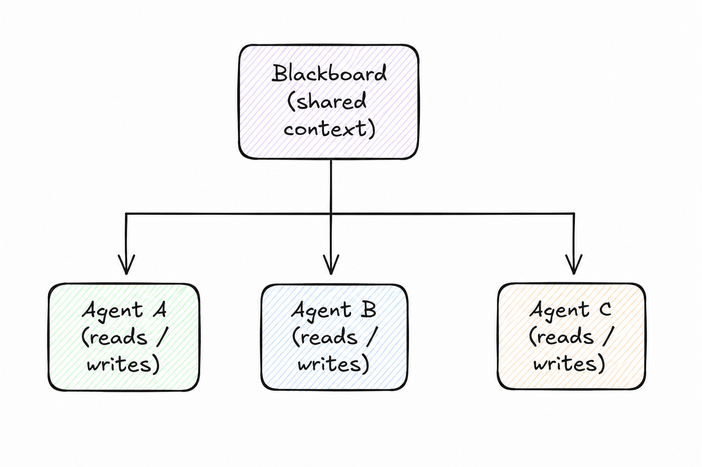

# Blackboard

> Share a structured, mutable context space that multiple agents read from and write to asynchronously.

**Category:** messaging
**EIP Analog:** [Shared Database](https://www.enterpriseintegrationpatterns.com/patterns/messaging/SharedDataBase.html) (extended for agent-specific concerns)

---

## Also Known As

Shared Context, Collaborative Memory, Agent Workspace

---

## Problem

Multiple agents work on different parts of the same problem. No single agent has the full picture, but they all need to read each other's intermediate results. Point-to-point messaging between every pair of agents is impractical (N² connections). A central coordinator that routes every message is a bottleneck.

---

## Solution

Maintain a shared "blackboard" — a structured key-value store or document that acts as the shared workspace. Agents read state relevant to their role, contribute their results by writing to the blackboard, and optionally observe changes via subscriptions. An optional controller monitors the blackboard and triggers agents when their preconditions are met.

---

## Diagram



---

## Participants

| Participant | Role |
|---|---|
| **Blackboard** | The shared, structured context store |
| **Knowledge Sources (Agents)** | Specialized agents that read relevant state, execute, and write results |
| **Controller** *(optional)* | Monitors the blackboard and activates agents when their preconditions are satisfied |

---

## Consequences

**Benefits:**
- ✅ Natural for parallel, loosely-coupled agents working on the same problem
- ✅ Agents contribute at their own pace without synchronization
- ✅ New agents can be added without modifying existing ones

**Trade-offs:**
- ❌ Requires conflict resolution when agents write to the same key simultaneously
- ❌ Hard to reason about causality and execution order without event sourcing
- ❌ Blackboard state can grow unbounded in long-running tasks

---

## Implementation

```python
# Blackboard using LangGraph shared state
from typing import TypedDict, Annotated
from langgraph.graph import StateGraph
import operator

class BlackboardState(TypedDict):
    query: str
    web_results: Annotated[list, operator.add]   # Agent A writes here
    db_results: Annotated[list, operator.add]    # Agent B writes here
    synthesis: str                               # Agent C reads both, writes here

def web_search_agent(state: BlackboardState):
    results = search_web(state["query"])
    return {"web_results": results}   # writes to blackboard

def db_query_agent(state: BlackboardState):
    results = query_database(state["query"])
    return {"db_results": results}    # writes to blackboard

def synthesis_agent(state: BlackboardState):
    # reads from blackboard — sees results from both agents
    combined = state["web_results"] + state["db_results"]
    return {"synthesis": summarize(combined)}

graph = StateGraph(BlackboardState)
graph.add_node("web", web_search_agent)
graph.add_node("db", db_query_agent)
graph.add_node("synthesize", synthesis_agent)
```

---

## Known Uses

- **LangGraph StateGraph** — the `State` object is a blackboard shared across all nodes in the graph
- **AutoGen shared memory** — agents in a conversation share a common message history as the blackboard
- **Multi-agent RAG systems** — a shared document store where retrieval agents write chunks and synthesis agents read them

---

## Related Patterns

- [Context Injection](../context/context-injection.md) — use instead when context is read-only and assembled before agent invocation
- [Orchestrator](../coordination/orchestrator.md) — the optional Controller in this pattern often resembles an Orchestrator
- [Choreography](../coordination/choreography.md) — agents can react to blackboard changes via events instead of polling

---

## References

- Corkill, D.D. (1991). "Blackboard Systems." *AI Expert*, 6(9):40-47.
- arXiv:2502.14321 — classifies Blackboard as one of three primary communication paradigms in LLM multi-agent systems
