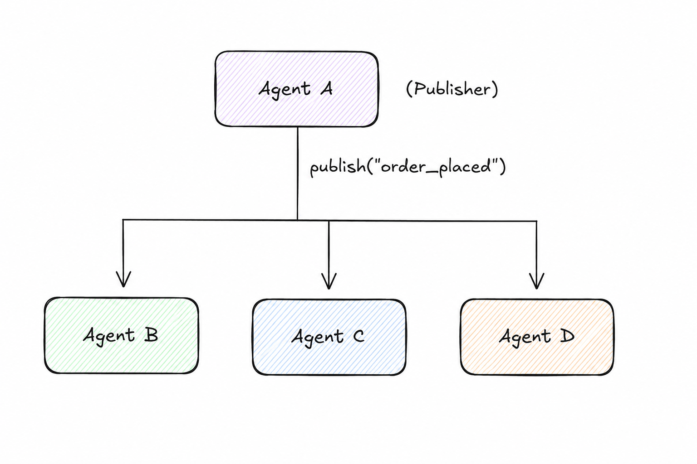

# Broadcast Message

> Send information from one agent to all interested agents simultaneously without knowing who they are.

**Category:** messaging
**EIP Analog:** [Publish-Subscribe Channel](https://www.enterpriseintegrationpatterns.com/patterns/messaging/PublishSubscribeChannel.html)

---

## Also Known As

Pub-Sub Agent, Event Broadcast, Agent Fan-Out

---

## Problem

An agent produces information — a completed subtask result, an observation, a state change — that multiple downstream agents need to act upon. The producer should not need to know who the consumers are, and consumers should be able to join or leave without modifying the producer.

---

## Solution

Publish the message to a shared channel or topic. Interested agents subscribe to the channel and react independently. The publisher has no knowledge of subscribers — it only knows the topic it publishes to. A message broker or event bus routes copies to all active subscribers.

---

## Diagram



---

## Participants

| Participant | Role |
|---|---|
| **Publisher Agent** | Produces the event/message and sends it to the topic |
| **Subscriber Agents** | Register interest in a topic and react to messages independently |
| **Channel / Broker** | Routes copies of each message to all subscribers (Kafka topic, Redis pub-sub, etc.) |

---

## Consequences

**Benefits:**
- ✅ Publisher is completely decoupled from subscribers — no address knowledge needed
- ✅ Adding a new subscriber agent requires no change to the publisher
- ✅ Each subscriber processes the message independently (parallel processing)

**Trade-offs:**
- ❌ No delivery guarantee without a durable broker (Kafka, RabbitMQ)
- ❌ Message ordering across subscribers is not guaranteed by default
- ❌ Risk of message storms if subscriber agents themselves publish new messages

---

## Implementation

```python
# Broadcast via Redis pub-sub (framework-agnostic)
import redis.asyncio as redis
import json

# Publisher agent
async def publish_research_complete(findings: dict):
    r = await redis.from_url("redis://localhost")
    await r.publish(
        "agent:research:complete",
        json.dumps({"findings": findings, "agent": "research-agent-01"}),
    )

# Subscriber agent (runs in separate process)
async def subscribe_and_react():
    r = await redis.from_url("redis://localhost")
    pubsub = r.pubsub()
    await pubsub.subscribe("agent:research:complete")

    async for message in pubsub.listen():
        if message["type"] == "message":
            data = json.loads(message["data"])
            await process_findings(data["findings"])
```

---

## Known Uses

- **AutoGen GroupChat** — the GroupChatManager broadcasts each agent message to all participants in the group
- **CrewAI event-driven flows** — task completion events can trigger multiple downstream crew members
- **Kafka-backed agent pipelines** — agents publish results to Kafka topics; downstream specialist agents subscribe

---

## Related Patterns

- [Scatter-Gather](../routing/scatter-gather.md) — use when you need results back from all receivers
- [Choreography](../coordination/choreography.md) — Broadcast Message is the communication primitive that enables choreography
- [Direct Message](./direct-message.md) — use instead when you need exactly one receiver and a response

---

## References

- Hohpe & Woolf (2003). *Enterprise Integration Patterns*: Publish-Subscribe Channel
- [AutoGen GroupChat](https://microsoft.github.io/autogen/docs/tutorial/conversation-patterns)
