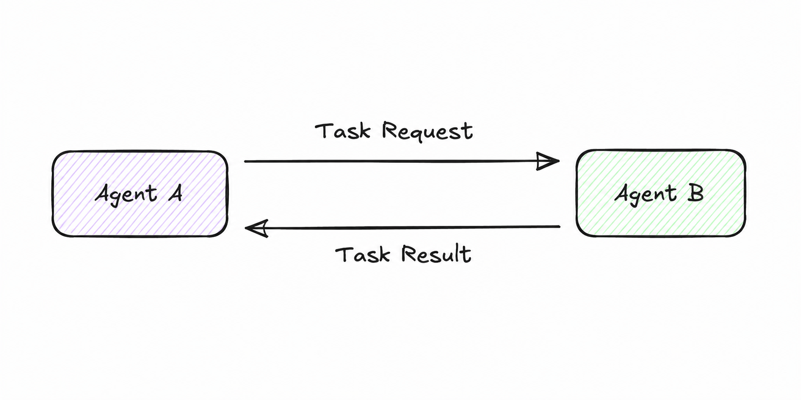

# Direct Message
**Category:** Messaging
**Maturity:** ★★ Established
**Also known as:** Point-to-Point Channel, Task Delegation, Direct Call

## Intent
Send a task from one agent to exactly one other agent through a dedicated point-to-point channel.

## Context
You have identified a specific agent that has the capability to handle a subtask. The calling agent knows the receiver's identity (via prior discovery or hard-coded routing) and expects a structured result back.

## Problem
An agent needs to delegate a specific subtask to another agent with known capabilities. Broadcasting to all agents wastes resources, and the sender needs a reliable response — not just fire-and-forget.

## Forces
- **F1 Latency vs. F2 Coupling** — direct calls have minimal latency (no intermediary) but create tight coupling: the sender must know the receiver's address. If the receiver moves or is replaced, the sender must change.
- **F8 Determinism** — the one-to-one channel makes the flow predictable and easy to trace: exactly one agent receives and handles the message.

## Solution
Establish a dedicated channel between two agents. The sender pushes a structured message (task + context) to the receiver's endpoint. The receiver acknowledges receipt, processes the task, and returns a result. The channel is exclusive to this sender-receiver pair for the duration of the task.



## Sample Code
Runnable implementation: [samples/python/messaging/direct_message.py](../../samples/python/messaging/direct_message.py)

```python
# Agent A delegates a task directly to Agent B
result = agent_b.invoke({"question": agent_a.generate_question()})
```

## Consequences
- ✅ Simple, predictable, and easy to trace in logs
- ✅ Result is returned synchronously or via callback; no polling needed
- ✅ Minimal latency — no intermediary hop (F1 resolved)
- ✅ Explicit, traceable message flow (F8, F6 resolved)
- ❌ Tight coupling — sender must know receiver address (F2 introduced)
- ❌ No load balancing or failover without additional infrastructure
- ❌ If the receiver is down, the sender must handle the failure explicitly

## When to avoid
- When the receiver identity may change at runtime — use [Agent Card Registry](../discovery/agent-card-registry.md) + [Content-Based Router](../routing/content-based-router.md) instead.
- When you need broadcast semantics — use [Broadcast Message](broadcast-message.md).
- When decoupling matters more than simplicity.

## Failure Modes Mitigated
Per [FAILURE-MAP.md](../FAILURE-MAP.md):
- **FM-1.4 Loss of context** ◐ — context is passed explicitly in every message, reducing silent context loss.
- **FM-2.4 Information withholding** ◐ — the receiving agent gets the full task description in one structured message.

## Known Uses
- **Google A2A Protocol** — the primary mechanism for agent-to-agent task delegation; each task is a Direct Message to a specific Agent Card endpoint
- **LangGraph node edges** — edges between nodes in a StateGraph are point-to-point: output of node A flows to node B and nowhere else
- **ReAct agents (tool calls)** — when an agent invokes a tool, the tool call is a direct message to that tool's handler

## Related Patterns
- *used-by* [Supervised Delegation](../coordination/supervised-delegation.md) — the supervisor delegates via Direct Message.
- *alternative-to* [Broadcast Message](broadcast-message.md) — when exactly one agent should handle the task.
- *uses* [Agent Card Registry](../discovery/agent-card-registry.md) — to discover the receiver address before sending.

## References
- Hohpe, G. & Woolf, B. (2003). *Enterprise Integration Patterns* — Point-to-Point Channel.
- Google (2025). *Agent-to-Agent (A2A) Protocol Specification.*
