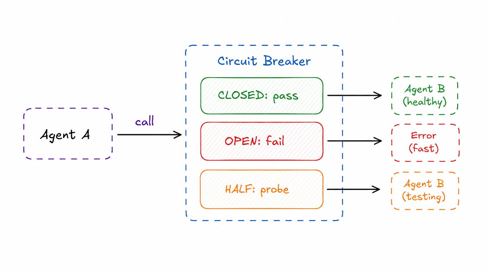

# Circuit Breaker

> Stop making calls to a failing agent or tool, allow time to recover, and automatically resume when healthy.

**Category:** resilience
**EIP Analog:** No direct EIP analog — pattern originates in Michael Nygard's *Release It!* (2007)

---

## Also Known As

Fault Isolator, Failure Limiter

---

## Problem

When an agent or tool dependency fails repeatedly, continued retries amplify the load on the failing component, consume caller resources, and cascade failures to unrelated parts of the system. You need a way to detect sustained failures and stop hitting a broken dependency — while letting it recover.

---

## Solution

Wrap calls to external agents/tools in a circuit breaker with three states. **Closed (normal):** calls pass through; failures are counted. **Open (tripped):** after N consecutive failures, the circuit opens; all calls fail immediately without reaching the downstream agent. **Half-Open (probing):** after a timeout, one probe call is allowed; if it succeeds, the circuit closes; if it fails, it reopens.

---

## Diagram



---

## Participants

| Participant | Role |
|---|---|
| **Caller Agent** | Makes calls through the circuit breaker |
| **Circuit Breaker** | Tracks failure state; decides whether to pass, block, or probe |
| **Downstream Agent / Tool** | The dependency being protected; gets recovery time when circuit is open |

---

## Consequences

**Benefits:**
- ✅ Prevents cascade failures — callers get fast failures instead of hanging
- ✅ Gives the downstream dependency time to recover without continued load
- ✅ Observable — circuit state is a real-time health signal

**Trade-offs:**
- ❌ Requires tuning of failure thresholds and recovery timeouts per dependency
- ❌ False positives can block healthy agents temporarily
- ❌ Half-open probe can still fail — adds complexity to timeout logic

---

## Implementation

```python
# Circuit breaker for agent/tool calls
import asyncio
from enum import Enum
from datetime import datetime, timedelta

class CircuitState(Enum):
    CLOSED = "closed"
    OPEN = "open"
    HALF_OPEN = "half_open"

class CircuitBreaker:
    def __init__(self, failure_threshold=3, recovery_timeout=30):
        self.state = CircuitState.CLOSED
        self.failure_count = 0
        self.failure_threshold = failure_threshold
        self.recovery_timeout = recovery_timeout
        self.opened_at: datetime | None = None

    async def call(self, func, *args, **kwargs):
        if self.state == CircuitState.OPEN:
            if datetime.now() - self.opened_at > timedelta(seconds=self.recovery_timeout):
                self.state = CircuitState.HALF_OPEN
            else:
                raise RuntimeError("Circuit is OPEN — downstream agent unavailable")

        try:
            result = await func(*args, **kwargs)
            self._on_success()
            return result
        except Exception as e:
            self._on_failure()
            raise

    def _on_success(self):
        self.failure_count = 0
        self.state = CircuitState.CLOSED

    def _on_failure(self):
        self.failure_count += 1
        if self.failure_count >= self.failure_threshold:
            self.state = CircuitState.OPEN
            self.opened_at = datetime.now()


# Usage with an A2A agent call
breaker = CircuitBreaker(failure_threshold=3, recovery_timeout=30)

async def call_research_agent(query: str) -> str:
    return await breaker.call(a2a_client.send_task_and_wait, query)
```

---

## Known Uses

- **Spring AI Resilience4j integration** — Spring AI supports Resilience4j circuit breakers wrapping tool and agent calls
- **LangChain retry policies** — `RetryWithError` and custom retry handlers implement failure counting analogous to circuit breaker logic
- **Temporal workflow activities** — Temporal's retry policy and heartbeat timeout implement circuit-breaker-like behavior for long-running agent activities

---

## Related Patterns

- [Dead Letter Agent](./dead-letter-agent.md) — route tasks to when the circuit stays open and callers need a fallback
- [Agent Proxy](../discovery/agent-proxy.md) — the proxy layer is the natural place to implement circuit breaking
- [Checkpoint & Resume](./checkpoint-resume.md) — resume a workflow from the last checkpoint after the circuit closes

---

## References

- Nygard, M. (2007). *Release It!*. Pragmatic Bookshelf. Chapter 5: Stability Patterns.
- [Resilience4j Circuit Breaker](https://resilience4j.readme.io/docs/circuitbreaker)
- [Spring AI: Resilience Patterns](https://docs.spring.io/spring-ai/reference/)
