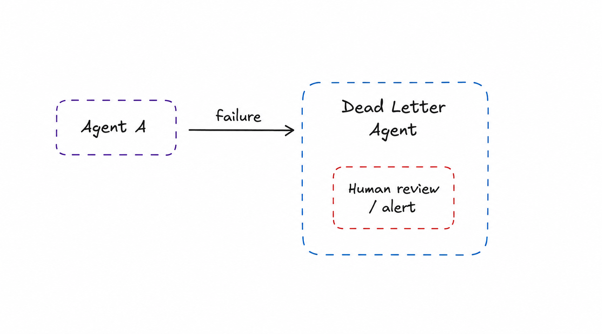

# Dead Letter Agent

> Route tasks that cannot be processed to a dedicated agent or human for inspection and resolution.

**Category:** resilience
**EIP Analog:** [Dead Letter Channel](https://www.enterpriseintegrationpatterns.com/patterns/messaging/DeadLetterChannel.html)

---

## Also Known As

Fallback Agent, Human-in-the-Loop Escalation, Error Sink

---

## Problem

In any agent system, some tasks will fail: the model refuses, the tool errors out, the task is malformed, or the confidence is too low to proceed. Without a safety net, failed tasks are silently dropped, leaving users without responses and operators without visibility.

---

## Solution

Any task that cannot be processed — after retries, after circuit breaking — is forwarded to a Dead Letter Agent. This agent may route to a human review queue, send an alert, log the failure for audit, or attempt a last-resort strategy (e.g., ask the user to clarify). The dead letter agent never loses the failed task.

---

## Diagram



---

## Participants

| Participant | Role |
|---|---|
| **Failed Agent** | Detects it cannot process the task and forwards to the dead letter agent |
| **Dead Letter Agent** | Receives unprocessable tasks; routes to human review, alerts, or audit |
| **Human Reviewer** | Inspects failed tasks; may manually complete, retry, or discard |
| **Audit Log** | Permanent record of all failures for post-hoc analysis |

---

## Consequences

**Benefits:**
- ✅ Zero silent data loss — every failure is captured
- ✅ Human-in-the-loop safety net for edge cases the system cannot handle autonomously
- ✅ Dead letter volume is an observable system health metric

**Trade-offs:**
- ❌ Requires human attention and operational process to drain the dead letter queue
- ❌ High dead letter volume signals a systemic problem that must be addressed at the source
- ❌ Task context must be preserved through the failure path to be useful for review

---

## Implementation

```python
# Dead Letter Agent with LangGraph interrupt
from langgraph.graph import StateGraph, END
from langgraph.checkpoint.sqlite import SqliteSaver
from typing import TypedDict

class TaskState(TypedDict):
    task: str
    result: str | None
    error: str | None
    retry_count: int

def process_agent(state: TaskState) -> TaskState:
    try:
        result = risky_operation(state["task"])
        return {"result": result}
    except Exception as e:
        return {"error": str(e), "retry_count": state.get("retry_count", 0) + 1}

def route_after_processing(state: TaskState) -> str:
    if state.get("result"):
        return "done"
    if state.get("retry_count", 0) < 2:
        return "retry"
    return "dead_letter"

def dead_letter_agent(state: TaskState) -> TaskState:
    # Persist to audit log
    log_failure(task=state["task"], error=state["error"])
    # Notify human reviewer
    send_alert(f"Task failed after retries: {state['task']}\nError: {state['error']}")
    # Interrupt: wait for human intervention via LangGraph's interrupt mechanism
    return state  # human can inject a corrected task via update_state()

graph = StateGraph(TaskState)
graph.add_node("process", process_agent)
graph.add_node("dead_letter", dead_letter_agent)
graph.add_conditional_edges("process", route_after_processing,
    {"done": END, "retry": "process", "dead_letter": "dead_letter"})
graph.add_edge("dead_letter", END)
```

---

## Known Uses

- **LangGraph `interrupt()`** — pauses agent execution at a node and waits for human input; the canonical implementation of human-in-the-loop dead letter handling
- **Anthropic's Agent Cookbook** — recommends human-in-the-loop as the explicit fallback for irreversible or high-stakes actions
- **CrewAI Human Input Tool** — tasks that agents cannot complete autonomously are escalated to a human via the `human_input=True` flag

---

## Related Patterns

- [Circuit Breaker](./circuit-breaker.md) — prevent cascading failures before they reach the dead letter agent
- [Checkpoint & Resume](./checkpoint-resume.md) — preserve task state so the dead letter agent has full context
- [Supervised Delegation](../coordination/supervised-delegation.md) — the supervisor may route to a dead letter agent as part of its failure handling

---

## References

- Hohpe & Woolf (2003). *Enterprise Integration Patterns*: Dead Letter Channel
- [Anthropic: Human-in-the-Loop Patterns](https://www.anthropic.com/research/building-effective-agents)
- [LangGraph: How to Add Human-in-the-Loop](https://langchain-ai.github.io/langgraph/how-tos/human_in_the_loop/)
