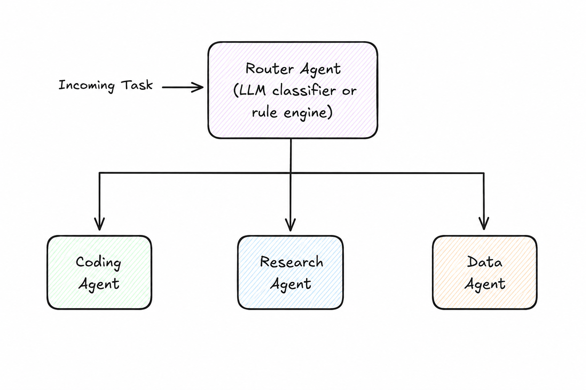

# Content-Based Router

> Route an incoming task to the appropriate agent based on the content, type, or intent of the task itself.

**Category:** routing
**EIP Analog:** [Content-Based Router](https://www.enterpriseintegrationpatterns.com/patterns/messaging/ContentBasedRouter.html)

---

## Also Known As

Semantic Router, Intent-Based Dispatcher, Agent Selector

---

## Problem

A system receives diverse tasks that require different specialized agents. A caller should not need to know which agent handles which type of task — that's an implementation detail. But you need a principled way to route each task to the right specialist without a central human deciding for each request.

---

## Solution

A router agent examines the content, metadata, or intent of each incoming task and forwards it to the appropriate specialist. The router may use: LLM-based intent classification (flexible, handles ambiguous input), rule-based matching (fast, deterministic for well-defined categories), or embedding similarity (good for semantic matching across many agents).

---

## Diagram



---

## Participants

| Participant | Role |
|---|---|
| **Router Agent** | Classifies incoming tasks and forwards to the appropriate specialist |
| **Specialist Agents** | Handle tasks for their domain; unaware of the routing logic |
| **Classifier** | The classification mechanism inside the router (LLM prompt, rules, embeddings) |

---

## Consequences

**Benefits:**
- ✅ Single entry point for callers — they don't need to know agent topology
- ✅ Specialist agents can evolve independently without changing callers
- ✅ Easy to add a new specialist: register it with the router

**Trade-offs:**
- ❌ Router is a bottleneck and single point of failure
- ❌ LLM-based classification adds latency vs. rule-based routing
- ❌ Misclassification sends tasks to wrong agents — hard to debug without logging

---

## Implementation

```python
# LLM-based intent router using LangGraph conditional edges
from langgraph.graph import StateGraph, END
from typing import TypedDict, Literal
from langchain_anthropic import ChatAnthropic

llm = ChatAnthropic(model="claude-haiku-4-5-20251001")  # fast model for routing

class RouterState(TypedDict):
    task: str
    route: str
    result: str

def classify_task(state: RouterState) -> RouterState:
    response = llm.invoke(
        f"Classify this task as exactly one of: coding, research, data_analysis.\n"
        f"Task: {state['task']}\nAnswer with only the category name."
    )
    return {"route": response.content.strip()}

def route_decision(state: RouterState) -> Literal["coding", "research", "data_analysis"]:
    return state["route"]

def coding_agent(state: RouterState) -> RouterState:
    return {"result": f"[Code] handled: {state['task']}"}

def research_agent(state: RouterState) -> RouterState:
    return {"result": f"[Research] handled: {state['task']}"}

def data_agent(state: RouterState) -> RouterState:
    return {"result": f"[Data] handled: {state['task']}"}

graph = StateGraph(RouterState)
graph.add_node("router", classify_task)
graph.add_node("coding", coding_agent)
graph.add_node("research", research_agent)
graph.add_node("data_analysis", data_agent)

graph.set_entry_point("router")
graph.add_conditional_edges("router", route_decision)
for node in ["coding", "research", "data_analysis"]:
    graph.add_edge(node, END)
```

---

## Known Uses

- **AWS Bedrock Supervisor Mode** — the supervisor agent classifies tasks and routes them to registered sub-agents based on their registered capabilities
- **LangGraph conditional edges** — `add_conditional_edges` implements content-based routing between graph nodes
- **Semantic Router (Aurelio AI)** — open-source library that uses embedding similarity to route LLM requests to different handlers

---

## Related Patterns

- [Agent Card Registry](../discovery/agent-card-registry.md) — the router can query the registry to discover available specialists dynamically
- [Orchestrator](../coordination/orchestrator.md) — use when routing is just the first step of a multi-step coordination flow
- [Scatter-Gather](./scatter-gather.md) — use instead when multiple specialists should handle the same task in parallel

---

## References

- Hohpe & Woolf (2003). *Enterprise Integration Patterns*: Content-Based Router
- [LangGraph Conditional Edges](https://langchain-ai.github.io/langgraph/concepts/low_level/#conditional-edges)
