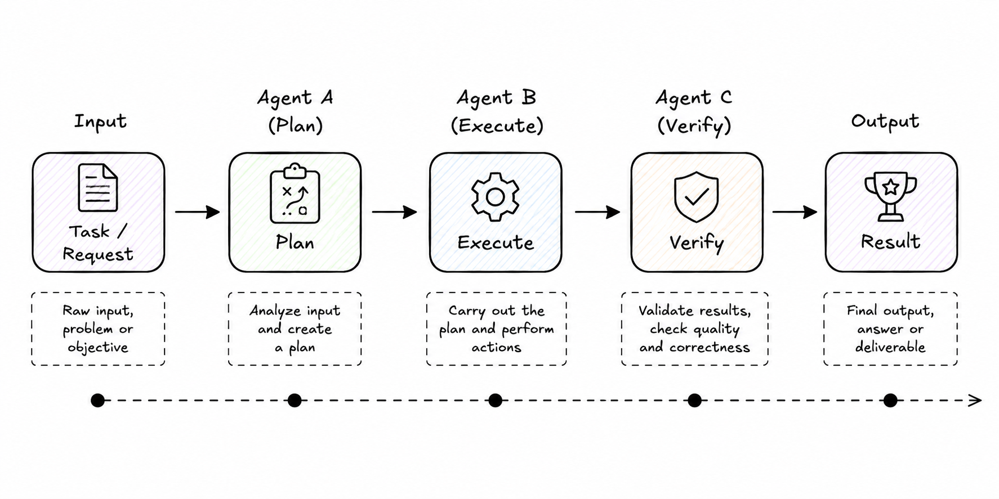

# Pipeline
**Category:** Routing
**Maturity:** ★★ Established
**Also known as:** Sequential Chain, Prompt Chaining, Pipes and Filters, Process Chain

> Pass a task through a sequence of agents, where each agent transforms or enriches the result before passing it to the next.

**EIP Analog:** [Pipes and Filters](https://www.enterpriseintegrationpatterns.com/patterns/messaging/PipesAndFilters.html)

---

## Intent

Chain focused agents as sequential pipeline stages so that complex multi-step transformations are decomposed into independently testable, replaceable steps — each receiving the output of the previous stage as its input.

---

## Context

A complex task requires a series of transformations where each step depends on the previous result. Putting all logic in one agent makes it unfocused and hard to test. Running steps in parallel is incorrect because they have data dependencies.

---

## Problem

A complex task requires a series of transformations where each step depends on the previous result: extract, then analyze, then format, then verify. Putting all logic in one agent makes it unfocused and hard to test. Running steps in parallel is incorrect because they have data dependencies.

---

## Forces

- **F8 Determinism** — fixed step order makes the pipeline reproducible and auditable.
- **F6 Observability** — each step's output is explicit state, inspectable between steps.
- **F1 Latency** — steps execute sequentially; wall-clock = sum of all steps (unlike Scatter-Gather).
- **F10 Adaptability** — limited: adding or reordering steps requires modifying the pipeline definition.

---

## Solution

Chain agents as pipeline stages. Each agent (filter) has a focused responsibility. It receives the output of the previous stage, transforms or enriches it, and passes the result to the next stage. The pipeline as a whole transforms raw input into a final output.

---

## Diagram



---

## Participants

| Participant | Role |
|---|---|
| **Source** | Provides the initial input |
| **Filter Agents** | Each stage transforms the data; focused on one responsibility |
| **Sink** | Consumes the final output |
| **Pipeline Runner** | Coordinates passing state between stages (orchestrator, LangGraph, etc.) |

---

## Sample Code

Runnable implementation: [samples/python/routing/pipeline.py](../../samples/python/routing/pipeline.py)

```python
# Pipeline using LangGraph as the runner
from langgraph.graph import StateGraph, END
from typing import TypedDict
from langchain_anthropic import ChatAnthropic

llm = ChatAnthropic(model="claude-sonnet-4-6")

class PipelineState(TypedDict):
    raw_text: str
    extracted_data: dict
    analysis: str
    final_report: str

def extract_agent(state: PipelineState) -> PipelineState:
    response = llm.invoke(
        f"Extract key entities (people, dates, amounts) as JSON from:\n{state['raw_text']}"
    )
    return {"extracted_data": {"raw": response.content}}

def analyze_agent(state: PipelineState) -> PipelineState:
    response = llm.invoke(
        f"Analyze the significance of this extracted data:\n{state['extracted_data']}"
    )
    return {"analysis": response.content}

def format_agent(state: PipelineState) -> PipelineState:
    response = llm.invoke(
        f"Format this analysis as an executive summary:\n{state['analysis']}"
    )
    return {"final_report": response.content}

graph = StateGraph(PipelineState)
graph.add_node("extract", extract_agent)
graph.add_node("analyze", analyze_agent)
graph.add_node("format", format_agent)

graph.set_entry_point("extract")
graph.add_edge("extract", "analyze")
graph.add_edge("analyze", "format")
graph.add_edge("format", END)
```

---

## Consequences

- ✅ Reproducible, auditable execution (F8, F6 resolved)
- ✅ Each step testable in isolation
- ✅ Easy to insert, remove, or reorder stages
- ❌ Sequential — total latency = sum of all steps (F1 introduced)
- ❌ A single failing step blocks the entire pipeline
- ❌ Context can be lost between stages if state management is not careful

---

## When to avoid

- When steps can run in parallel — use Scatter-Gather.
- When the sequence must adapt at runtime — use Orchestrator or Magentic.

---

## Failure Modes Mitigated

Per [FAILURE-MAP.md](../FAILURE-MAP.md):
- **FM-1.3 Step repetition** ◐ — explicit step state makes accidental repetition visible.
- **FM-1.5 Unaware of termination conditions** ◐ — a fixed pipeline has a defined last step; completion is unambiguous.

---

## Known Uses

- **Anthropic "Prompt Chaining"** — the canonical agentic workflow where each LLM call feeds the next
- **LangGraph linear graphs** — sequential node chains are the simplest LangGraph topology
- **CrewAI Sequential Process** — tasks executed one after another with output passed as context to the next
- **Data processing pipelines** — ETL-style agent chains: fetch → clean → embed → store

---

## Related Patterns

- *is-a* [Orchestrator](../coordination/orchestrator.md) — a linear orchestrator is a pipeline.
- *alternative-to* [Scatter-Gather](scatter-gather.md) — sequential vs. parallel.
- *used-by* [Checkpoint & Resume](../resilience/checkpoint-resume.md) — pipeline steps are natural checkpoint boundaries.

---

## References

- Hohpe, G. & Woolf, B. (2003). *Enterprise Integration Patterns* — Pipes and Filters.
- Anthropic (2024). *Building Effective Agents* — Prompt Chaining.
- Cemri, M. et al. (2025). arXiv:2503.13657.
- [Anthropic: Building Effective Agents — Prompt Chaining](https://www.anthropic.com/research/building-effective-agents)
