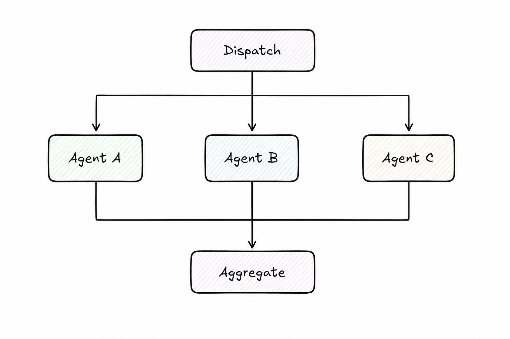

# Scatter-Gather

> Send the same task to multiple agents in parallel, then aggregate their responses into a single coherent result.

**Category:** routing
**EIP Analog:** [Scatter-Gather](https://www.enterpriseintegrationpatterns.com/patterns/messaging/BroadcastAggregate.html)

---

## Also Known As

Fan-Out / Fan-In, Parallel Dispatch, Multi-Agent Ensemble

---

## Problem

Some tasks benefit from multiple independent perspectives. Sequential querying of agents is slow, and a single agent's answer may have blind spots, biases, or errors. You need parallel execution across multiple agents but a single coherent result.

---

## Solution

A dispatcher sends the same task to N agents simultaneously. Each agent processes independently without awareness of the others. A gatherer waits for all responses (or a timeout) and passes them to a synthesis step — which may vote, merge, rank, or use a final agent to produce the consolidated answer.

---

## Diagram



---

## Participants

| Participant | Role |
|---|---|
| **Dispatcher** | Sends identical (or parameterized) tasks to all agents simultaneously |
| **Worker Agents** | Process the task independently; unaware of parallel execution |
| **Aggregator** | Collects results and synthesizes a final answer (majority vote, LLM synthesis, etc.) |

---

## Consequences

**Benefits:**
- ✅ Parallel execution reduces latency vs. sequential querying
- ✅ Multiple independent perspectives improve correctness for complex or ambiguous tasks
- ✅ Naturally fault-tolerant — if one agent fails, the majority can still produce a result

**Trade-offs:**
- ❌ N× token cost compared to a single agent call
- ❌ Aggregation is non-trivial — synthesis agents can themselves introduce errors
- ❌ Requires careful timeout handling when some agents are slower than others

---

## Implementation

```python
# Scatter-Gather with LangGraph parallel nodes
import asyncio
from langchain_anthropic import ChatAnthropic
from langgraph.graph import StateGraph, END
from typing import TypedDict, Annotated
import operator

llm = ChatAnthropic(model="claude-sonnet-4-6")

class ScatterState(TypedDict):
    task: str
    responses: Annotated[list[str], operator.add]
    final_answer: str

async def agent_perspective(state: ScatterState, persona: str) -> dict:
    response = await llm.ainvoke(
        f"You are a {persona}. Answer this: {state['task']}"
    )
    return {"responses": [response.content]}

async def scatter(state: ScatterState) -> dict:
    results = await asyncio.gather(
        agent_perspective(state, "skeptic"),
        agent_perspective(state, "optimist"),
        agent_perspective(state, "domain expert"),
    )
    combined = []
    for r in results:
        combined.extend(r["responses"])
    return {"responses": combined}

def gather(state: ScatterState) -> dict:
    combined = "\n\n---\n\n".join(
        f"Perspective {i+1}:\n{r}" for i, r in enumerate(state["responses"])
    )
    synthesis = llm.invoke(
        f"Synthesize these perspectives into one coherent answer:\n\n{combined}"
    )
    return {"final_answer": synthesis.content}
```

---

## Known Uses

- **Multi-Agent Debate (Google DeepMind)** — multiple LLM instances debate a question; a judge synthesizes the winning argument
- **Anthropic's "Parallelization" workflow** — scatter identical tasks across multiple subagents and aggregate results
- **LLM-as-judge ensembles** — scatter an evaluation task to multiple LLM judges and take the majority verdict

---

## Related Patterns

- [Broadcast Message](../messaging/broadcast-message.md) — use instead when you don't need results back (fire-and-forget)
- [Orchestrator](../coordination/orchestrator.md) — coordinates the scatter and gather steps
- [Pipeline](./pipeline.md) — use instead when tasks must be sequential, not parallel

---

## References

- Hohpe & Woolf (2003). *Enterprise Integration Patterns*: Scatter-Gather
- Du et al. (2023). "Improving Factuality and Reasoning in Language Models through Multiagent Debate." arXiv:2305.14325
- [Anthropic: Building Effective Agents — Parallelization](https://www.anthropic.com/research/building-effective-agents)
