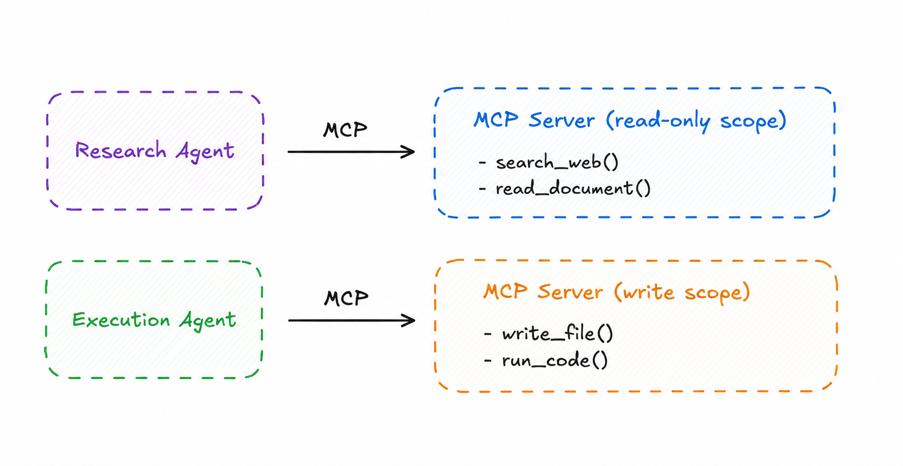

# Least-Privilege Tool Scope

> Grant each agent access only to the minimum set of tools and resources required for its task.

**Category:** security
**EIP Analog:** No direct EIP analog — applies the security principle of least privilege to the MCP tool layer

---

## Also Known As

Minimal Tool Surface, Scoped MCP Server, Tool Sandboxing

---

## Problem

Agents with access to powerful tools — code execution, database writes, file deletion, external API calls — can cause irreversible damage through prompt injection attacks, LLM errors, or misconfigured prompts. Giving every agent access to all tools amplifies the blast radius of any failure.

---

## Solution

Define tool scopes at the MCP server level. Each agent role receives a connection to an MCP server configured with only the tools and resources relevant to that role. Scope is enforced by the MCP server — not by prompting the agent to "only use certain tools." An agent that cannot see a tool cannot call it.

---

## Diagram



---

## Participants

| Participant | Role |
|---|---|
| **Agent** | Operates within its tool scope; cannot request tools outside its MCP server's exposure |
| **Scoped MCP Server** | Configured with a specific subset of tools for a specific agent role |
| **Tool Administrator** | Defines and maintains scope definitions per agent role |

---

## Consequences

**Benefits:**
- ✅ Limits blast radius — a compromised or confused agent can only damage what's in its scope
- ✅ Tool access is declared and auditable — security reviews can verify scope definitions
- ✅ Defense against prompt injection: injected instructions cannot invoke out-of-scope tools

**Trade-offs:**
- ❌ Requires upfront role design — scopes must be defined before agents are deployed
- ❌ Overly restrictive scopes block legitimate agent actions; requires iterative tuning
- ❌ Scope management overhead grows as the number of agent roles increases

---

## Implementation

```python
# Scoped MCP server — only exposes read-only tools to the research agent
from mcp.server import Server
from mcp import types

# READ-ONLY scope for Research Agent
research_server = Server("research-tools")

@research_server.list_tools()
async def research_tools() -> list[types.Tool]:
    return [
        types.Tool(
            name="search_web",
            description="Search the web for information",
            inputSchema={"type": "object", "properties": {"query": {"type": "string"}}},
        ),
        types.Tool(
            name="read_document",
            description="Read a document by URL",
            inputSchema={"type": "object", "properties": {"url": {"type": "string"}}},
        ),
        # write_file, run_code, delete_* are NOT listed — agent cannot call them
    ]


# WRITE scope for Execution Agent — separate server instance
execution_server = Server("execution-tools")

@execution_server.list_tools()
async def execution_tools() -> list[types.Tool]:
    return [
        types.Tool(
            name="write_file",
            description="Write content to a file",
            inputSchema={
                "type": "object",
                "properties": {"path": {"type": "string"}, "content": {"type": "string"}},
            },
        ),
        types.Tool(
            name="run_code",
            description="Execute Python code in a sandbox",
            inputSchema={"type": "object", "properties": {"code": {"type": "string"}}},
        ),
        # delete_database is NOT listed — even execution agents don't have this
    ]
```

---

## Known Uses

- **Anthropic MCP permission model** — Claude Desktop and Claude.ai allow users to configure which MCP servers (and therefore which tools) each session can access
- **AWS IAM roles for agents** — each AWS Bedrock agent assumes an IAM role with only the permissions needed for its tasks
- **Anthropic's guidance on minimal footprint** — explicitly recommends requesting only necessary permissions and preferring reversible over irreversible actions

---

## Related Patterns

- [Trust Boundary](./trust-boundary.md) — tool scope is enforced within a trust zone; trust boundaries define which agents get which scopes
- [Prompt Firewall](./prompt-firewall.md) — complement least-privilege scope with prompt injection defense
- [Tool Provider](../context/tool-provider.md) — the MCP Tool Server pattern being scoped here

---

## References

- [MCP Security Best Practices](https://modelcontextprotocol.io/docs/concepts/architecture)
- [Anthropic: Building Effective Agents — Minimal Footprint](https://www.anthropic.com/research/building-effective-agents)
- arXiv:2505.03864 — analyzes security risks from combined A2A+MCP tool access; recommends scope separation
