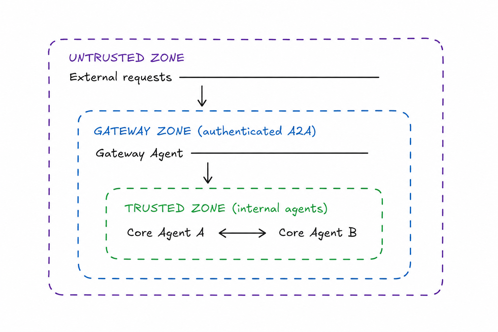

# Trust Boundary

> Explicitly define which agents trust which other agents, and at what level, preventing unauthorized task delegation or data access.

**Category:** security
**EIP Analog:** No direct EIP analog — applies network security zone concepts to agent-to-agent communication

---

## Also Known As

Trust Zone, Security Perimeter, Agent Trust Model

---

## Problem

In a multi-agent system using A2A, an attacker or compromised agent may attempt to: impersonate a trusted agent, inject malicious tasks through agent-to-agent channels, or escalate privileges by claiming higher trust than warranted. Without explicit trust levels, any agent that can reach another agent's endpoint can send it tasks.

---

## Solution

Define trust tiers explicitly. Agents verify the identity and trust level of callers via Agent Card authentication (OAuth/bearer tokens, mTLS) before accepting tasks. Assign agents to trust zones — external-facing agents are in a lower trust zone and interact with higher trust zones only through a gateway. Internal agents in the same zone can call each other directly.

---

## Diagram



---

## Participants

| Participant | Role |
|---|---|
| **Gateway Agent** | Authenticates external agents; translates and forwards to internal agents |
| **Internal Agents** | Trust each other within their zone; verify gateway identity at zone entry |
| **Identity Provider** | Issues and validates tokens for Agent Card authentication (OAuth, mTLS CA) |

---

## Consequences

**Benefits:**
- ✅ Defense in depth — perimeter + internal zone separation
- ✅ Limits lateral movement — a compromised external agent cannot directly call internal agents
- ✅ Auditable trust decisions — every cross-boundary call requires explicit authentication

**Trade-offs:**
- ❌ Trust boundaries must be updated as the agent topology evolves
- ❌ Overly strict internal boundaries slow down legitimate agent collaboration
- ❌ Gateway becomes a bottleneck and must be highly available

---

## Implementation

```python
# A2A gateway agent that verifies trust before forwarding
from fastapi import FastAPI, Header, HTTPException
from a2a.types import SendTaskRequest
from a2a.client import A2AClient
import jwt  # PyJWT

app = FastAPI()

TRUSTED_ISSUER = "https://auth.example.com"
INTERNAL_AGENT_URL = "https://internal-agents.example.com/core"

def verify_agent_token(token: str) -> dict:
    """Verify the calling agent's JWT issued by our identity provider."""
    try:
        return jwt.decode(
            token,
            options={"verify_signature": True},
            algorithms=["RS256"],
            issuer=TRUSTED_ISSUER,
        )
    except jwt.InvalidTokenError as e:
        raise HTTPException(status_code=401, detail=f"Invalid agent token: {e}")

@app.post("/tasks/send")
async def gateway_forward(
    request: SendTaskRequest,
    authorization: str = Header(...),
):
    token = authorization.removeprefix("Bearer ")
    claims = verify_agent_token(token)

    # Only forward if caller has the required trust scope
    if "agent:delegate" not in claims.get("scopes", []):
        raise HTTPException(status_code=403, detail="Insufficient trust scope")

    # Forward to internal agent (internal zone — no re-auth needed)
    internal_client = A2AClient(url=INTERNAL_AGENT_URL)
    return await internal_client.send_task(request)
```

---

## Known Uses

- **A2A authentication via Agent Cards** — the A2A spec defines `authentication.schemes` in Agent Cards; gateway agents validate these before forwarding
- **Enterprise agent mesh deployments** — large-scale deployments (Salesforce Agentforce, ServiceNow) implement trust zones between external customer-facing agents and internal system agents
- **Zero-trust agent networks** — applying zero-trust principles: every agent-to-agent call requires authentication regardless of network location

---

## Related Patterns

- [Agent Proxy](../discovery/agent-proxy.md) — the gateway agent is typically implemented as an Agent Proxy
- [Least-Privilege Tool Scope](./least-privilege-tool-scope.md) — trust zones define which tools are accessible; scope enforcement is complementary
- [Prompt Firewall](./prompt-firewall.md) — apply prompt injection defense at the gateway before forwarding to internal agents

---

## References

- [A2A Security Considerations](https://a2a-protocol.org/specification/latest/Agent-to-Agent%20Protocol%20Specification#security-considerations)
- arXiv:2505.03864 — analyzes trust model differences between A2A and MCP and resulting security risks
- arXiv:2602.11327 — threat modeling for AI agent protocols; classifies confusion, downgrade, and relay-abuse attacks
